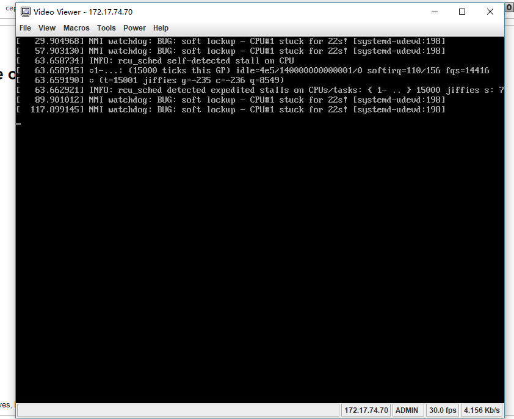
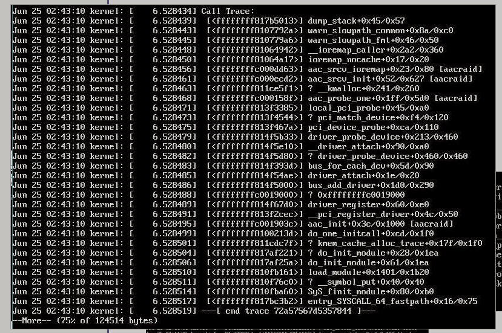
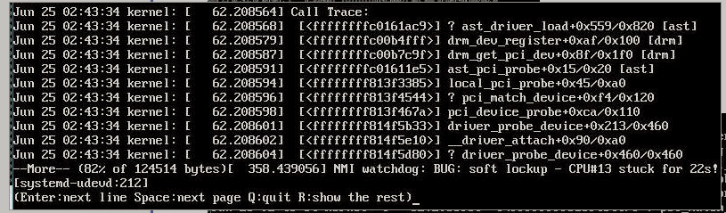
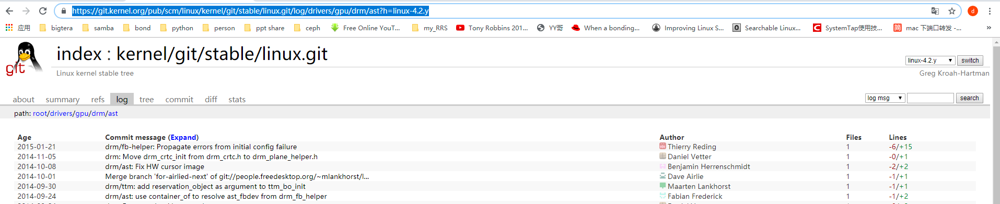
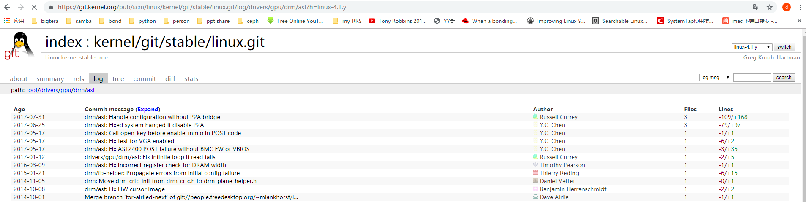

# 背景

Gigabyte 1U16盘位机器安装我们iso（基于ubuntu14.04），发现安装过程卡住，有softlock up，报错如下：



通过rescue broken system选项进入busybox，检查/var/log/syslog 发现 有如下的call trace

* aacraid call trace

  

* ast call trace

  


# 原因分析

当前linux installer kernel的版本是 4.2.0-27（可以在 rescue broken system中的busybox 通过uname命令可以查询到）。

检查linux kernel官网的patch 更新，发现4.2版本在2015年之后就没有更新了，见如下截图

> <https://git.kernel.org/pub/scm/linux/kernel/git/stable/linux.git/log/drivers/gpu/drm/ast?h=linux-4.2.y>




我们主线版本的kernel是4.1 版本，检查4.1的patch，更新到了2017年左右，如下



从 4.1 和4.2 的patch 更新情况来看，4.1 更新的更全些，并且4.1更新的patch和我们报错的call trace也相关，所以打算将 4.1上2015年之后更新的几个patch cherry-pick到4.2的版本，然后重新build出ast模块的ko，尝试是否能解决问题


# 处理步骤

从上面的分析得出要做的事情是：从kenrnel 4.2的source code上 cherry-pick 4.1 版本上2015年之后更新的几个commit，然后build 出新的ast.ko 文件，然后更新到我们的iso中，具体步骤如下：

## 1. patch 4.2版本的kernel source code

```
1，进入kernel source code 切换到4.2.y分支
wsg in /mnt/code/ezcloudstore/linux_official/linux-stable on linux-4.15.y λgit checkout -b linux-4.2.y origin/linux-4.2.y
Checking out files: 100% (55457/55457), done.
Branch linux-4.2.y set up to track remote branch linux-4.2.y from origin.
Switched to a new branch 'linux-4.2.y'

2，cherry picker 4.1版本2015年之后的7个commit
wsg in /mnt/code/ezcloudstore/linux_official/linux-stable on linux-4.2.y λ git cherry-pick 2d02b8bdba322b527c5f5168ce1ca10c2d982a78
[linux-4.2.y 4bfac38] drm/ast: Fix incorrect register check for DRAM width
 Author: Timothy Pearson <tpearson@raptorengineeringinc.com>
 1 file changed, 1 insertion(+), 1 deletion(-)
wsg in /mnt/code/ezcloudstore/linux_official/linux-stable on linux-4.2.y λ git cherry-pick 298360af3dab45659810fdc51aba0c9f4097e4f6 
[linux-4.2.y 3a4cd57] drivers/gpu/drm/ast: Fix infinite loop if read fails
 Author: Russell Currey <ruscur@russell.cc>
 1 file changed, 5 insertions(+), 2 deletions(-)
wsg in /mnt/code/ezcloudstore/linux_official/linux-stable on linux-4.2.y λ git cherry-pick 3856081eede297b617560b85e948cfb00bb395ec 
[linux-4.2.y adf9cf4] drm/ast: Fix AST2400 POST failure without BMC FW or VBIOS
 Author: Y.C. Chen <yc_chen@aspeedtech.com>
 1 file changed, 35 insertions(+), 3 deletions(-)
wsg in /mnt/code/ezcloudstore/linux_official/linux-stable on linux-4.2.y λ git cherry-pick 905f21a49d388de3e99438235f3301cabf0c0ef4 
[linux-4.2.y 6f4ddcc] drm/ast: Fix test for VGA enabled
 Author: Y.C. Chen <yc_chen@aspeedtech.com>
 1 file changed, 2 insertions(+), 6 deletions(-)
wsg in /mnt/code/ezcloudstore/linux_official/linux-stable on linux-4.2.y λ git cherry-pick 9bb92f51558f2ef5f56c257bdcea0588f31d857e 
[linux-4.2.y 9921668] drm/ast: Call open_key before enable_mmio in POST code
 Author: Y.C. Chen <yc_chen@aspeedtech.com>
 1 file changed, 1 insertion(+), 1 deletion(-)
wsg in /mnt/code/ezcloudstore/linux_official/linux-stable on linux-4.2.y λ git cherry-pick 6c971c09f38704513c426ba6515f22fb3d6c87d5 
[linux-4.2.y ae80bd8] drm/ast: Fixed system hanged if disable P2A
 Author: Y.C. Chen <yc_chen@aspeedtech.com>
 3 files changed, 97 insertions(+), 79 deletions(-)
wsg in /mnt/code/ezcloudstore/linux_official/linux-stable on linux-4.2.y λ git cherry-pick 71f677a91046599ece96ebab21df956ce909c456 
[linux-4.2.y f65fa6c] drm/ast: Handle configuration without P2A bridge
 Author: Russell Currey <ruscur@russell.cc>
 3 files changed, 168 insertions(+), 109 deletions(-)
wsg in /mnt/code/ezcloudstore/linux_official/linux-stable on linux-4.2.y λ 
```

## 2. 编译 ast driver ko 文件

* 将path好的kernel code 复制到我们产品的linux 机器上，并且要安装好 installer kernel 版本的 linux header 包

```
1，安装好的 installer kernel 版本信息如下：
root@node243:~/wsg# dpkg -l |grep 4.2.0-27.32
ii  linux-headers-4.2.0-27               4.2.0-27.32~14.04.1                        all          Header files related to Linux kernel version 4.2.0
iF  linux-headers-4.2.0-27-generic       4.2.0-27.32~14.04.1                        amd64        Linux kernel headers for version 4.2.0 on 64 bit x86 SMP
root@node243:~/wsg# 

安装4.2.0的linux header后，会在/usr/src/中生成对应版本的目录，
root@node243:/usr/src/linux-headers-4.2.0-27-generic# ll
total 1688
drwxr-xr-x  8 root root    4096 Jun 25 18:43 ./
drwxr-xr-x 12 root root    4096 Jun 25 12:10 ../
drwxr-xr-x  3 root root    4096 Jun 25 12:10 arch/
lrwxrwxrwx  1 root root      31 Jan 23  2016 block -> ../linux-headers-4.2.0-27/block/
-rw-r--r--  1 root root  184783 Jan 23  2016 .config
-rw-r--r--  1 root root  184907 Jan 23  2016 .config.old
lrwxrwxrwx  1 root root      32 Jan 23  2016 crypto -> ../linux-headers-4.2.0-27/crypto/
lrwxrwxrwx  1 root root      39 Jan 23  2016 Documentation -> ../linux-headers-4.2.0-27/Documentation/
lrwxrwxrwx  1 root root      33 Jan 23  2016 drivers -> ../linux-headers-4.2.0-27/drivers/
drwxr-xr-x  3 root root    4096 Jun 25 18:43 drm/
lrwxrwxrwx  1 root root      34 Jan 23  2016 firmware -> ../linux-headers-4.2.0-27/firmware/
lrwxrwxrwx  1 root root      28 Jan 23  2016 fs -> ../linux-headers-4.2.0-27/fs/
drwxr-xr-x  4 root root    4096 Jun 25 12:10 include/
lrwxrwxrwx  1 root root      30 Jan 23  2016 init -> ../linux-headers-4.2.0-27/init/
lrwxrwxrwx  1 root root      29 Jan 23  2016 ipc -> ../linux-headers-4.2.0-27/ipc/
lrwxrwxrwx  1 root root      32 Jan 23  2016 Kbuild -> ../linux-headers-4.2.0-27/Kbuild
lrwxrwxrwx  1 root root      33 Jan 23  2016 Kconfig -> ../linux-headers-4.2.0-27/Kconfig
drwxr-xr-x  2 root root    4096 Jun 25 12:10 kernel/
lrwxrwxrwx  1 root root      29 Jan 23  2016 lib -> ../linux-headers-4.2.0-27/lib/
lrwxrwxrwx  1 root root      34 Jan 23  2016 Makefile -> ../linux-headers-4.2.0-27/Makefile
-rw-r--r--  1 root root    1003 Jan 23  2016 .missing-syscalls.d
lrwxrwxrwx  1 root root      28 Jan 23  2016 mm -> ../linux-headers-4.2.0-27/mm/
-rw-r--r--  1 root root 1312378 Jan 23  2016 Module.symvers
lrwxrwxrwx  1 root root      29 Jan 23  2016 net -> ../linux-headers-4.2.0-27/net/
lrwxrwxrwx  1 root root      33 Jan 23  2016 samples -> ../linux-headers-4.2.0-27/samples/
drwxr-xr-x  7 root root    4096 Jun 25 12:10 scripts/
lrwxrwxrwx  1 root root      34 Jan 23  2016 security -> ../linux-headers-4.2.0-27/security/
lrwxrwxrwx  1 root root      31 Jan 23  2016 sound -> ../linux-headers-4.2.0-27/sound/
drwxr-xr-x  2 root root    4096 Jan 23  2016 .tmp_versions/
lrwxrwxrwx  1 root root      31 Jan 23  2016 tools -> ../linux-headers-4.2.0-27/tools/
lrwxrwxrwx  1 root root      32 Jan 23  2016 ubuntu -> ../linux-headers-4.2.0-27/ubuntu/
lrwxrwxrwx  1 root root      29 Jan 23  2016 usr -> ../linux-headers-4.2.0-27/usr/
lrwxrwxrwx  1 root root      30 Jan 23  2016 virt -> ../linux-headers-4.2.0-27/virt/
root@node243:/usr/src/linux-headers-4.2.0-27-generic# 

注意：其中Module.symvers是和该kernel版本严格匹配的，在insmod时，moudule会和该文件里面的校验值进行比较，如果比较不通过，module就无法使用

```

>Module.symvers参考资料
>
>参考：<https://www.ibm.com/developerworks/cn/linux/l-cn-kernelmodules/index.html#listing1>

```
安装linux header的参考命令如下
	apt-get download linux-headers-4.2.0-27
	apt-get download linux-headers-4.2.0-27-generic
	sudo dpkg -i linux-headers-4.2.0-27_4.2.0-27.32~14.04.1_all.deb
	sudo dpkg -i linux-headers-4.2.0-27-generic_4.2.0-27.32~14.04.1_amd64.deb
```


* 将步骤1中 patch 好的 模块直接 复制到 安装我们产品的机器上（node243），ast模块在gpu目录中，

```
root@node243:~/wsg# pwd
/root/wsg
root@node243:~/wsg# ll
total 16
drwxr-xr-x 4 root root 4096 Jun 26 18:30 ./
drwx------ 7 root root 4096 Jun 26 18:23 ../
drwxrwxr-x 6 root root 4096 Jun 26 18:29 gpu/
root@node243:~/wsg# 

```

* build ast 模块

```
root@node243:~/wsg/gpu/drm/ast# make -j4 CONFIG_DEBUG_INFO=1 -C /usr/src/linux-headers-4.2.0-27-generic M=${PWD} 
make: Entering directory `/usr/src/linux-headers-4.2.0-27-generic'
  LD      /root/wsg/gpu/drm/ast/built-in.o
  CC [M]  /root/wsg/gpu/drm/ast/ast_drv.o
  CC [M]  /root/wsg/gpu/drm/ast/ast_main.o
  CC [M]  /root/wsg/gpu/drm/ast/ast_mode.o
  CC [M]  /root/wsg/gpu/drm/ast/ast_fb.o
  CC [M]  /root/wsg/gpu/drm/ast/ast_ttm.o
  CC [M]  /root/wsg/gpu/drm/ast/ast_post.o
  CC [M]  /root/wsg/gpu/drm/ast/ast_dp501.o
  LD [M]  /root/wsg/gpu/drm/ast/ast.o
  Building modules, stage 2.
  MODPOST 1 modules
  CC      /root/wsg/gpu/drm/ast/ast.mod.o
  LD [M]  /root/wsg/gpu/drm/ast/ast.ko
make: Leaving directory `/usr/src/linux-headers-4.2.0-27-generic'
root@node243:~/wsg/gpu/drm/ast# 

```


##3. 替换iso 中的installer kernel 

iso中的installer kernel 为 install/initrd.gz ，该文件是cpio格式经过gzip压缩生成

```
root@converger-124:/mnt/bigtera/install# pwd
/mnt/bigtera/install
root@converger-124:/mnt/bigtera/install# ll initrd.gz 
-r-xr-xr-x 1 root root 12106172 Jan 15 12:01 initrd.gz*
root@converger-124:/mnt/bigtera/install# file initrd.gz 
initrd.gz: gzip compressed data, from Unix, last modified: Sun Oct 14 12:14:32 2018
root@converger-124:/mnt/bigtera/install# 
```

解压initrd.gz的命令参考如下：

```
创建解压目录 mkdir -p /root/initrd_dir
cd /root/initrd_dir
root@node243:~/initrd_dir# gzip -d -c < ../initrd.gz | cpio -i

```

查看解压后的initrd_dir目录如下，发现目录结构类似于一个完整的linux目录（正是这个linux系统，我们才能完成OS的安装过程），

```
root@node243:~/initrd_dir# pwd
/root/initrd_dir
root@node243:~/initrd_dir# ll
total 76
drwxr-xr-x 17 root root 4096 Jun 26 12:49 ./
drwx------  6 root root 4096 Jun 26 13:59 ../
drwxr-xr-x  2 1010 1010 4096 Jun 26 12:49 bin/
drwxr-xr-x  2 1010 1010 4096 Jun 26 12:49 dev/
drwxr-xr-x 12 1010 1010 4096 Jun 26 12:49 etc/
-rwxr-xr-x  1 1010 1010  456 Jun 26 12:49 init*
drwxr-xr-x  2 1010 1010 4096 Jun 26 12:49 initrd/
drwxr-xr-x 15 1010 1010 4096 Jun 26 12:49 lib/
drwxrwxr-x  2 1010 1010 4096 Jun 26 12:49 lib64/
drwxr-xr-x  2 1010 1010 4096 Jun 26 12:49 media/
drwxr-xr-x  2 1010 1010 4096 Jun 26 12:49 mnt/
-rw-r--r--  1 1010 1010  120 Jun 26 12:49 preseed.cfg
drwxr-xr-x  2 1010 1010 4096 Jun 26 12:49 proc/
drwxr-xr-x  2 1010 1010 4096 Jun 26 12:49 run/
drwxr-xr-x  2 1010 1010 4096 Jun 26 12:49 sbin/
drwxr-xr-x  2 1010 1010 4096 Jun 26 12:49 sys/
drwxrwxr-x  2 1010 1010 4096 Jun 26 12:49 tmp/
drwxrwxr-x  6 1010 1010 4096 Jun 26 12:49 usr/
drwxrwxr-x  7 1010 1010 4096 Jun 26 12:49 var/
root@node243:~/initrd_dir# 

我们本次要更新的ast 驱动正是位于上面的 lib目录, 所以用步骤2中生成的ko文件替换下面文件
root@node243:~/initrd_dir# ll lib/modules/4.2.0-27-generic/kernel/drivers/gpu/drm/ast/ast.ko 
-rw-r--r-- 1 1010 1010 2020516 Jun 26 12:52 lib/modules/4.2.0-27-generic/kernel/drivers/gpu/drm/ast/ast.ko

```


替换完驱动ko文件，我们需要重新生成 initrd.gz ,命令参考如下

```
cd /root/initrd_dir
find . | cpio --create --format='newc' | gzip > ../initrd.gz

在目录initrd_dir 的上层目录，就可以看到新生成的 initrd.gz

```


## 4. 重新 打包 iso

initrd.gz patch完成后，需要将 该文件重新再打包回 iso目录，方法如下：

```
1，进入iso目录
root@converger-124:/vol/share/shengguo/bigtera_iso_build# pwd
/vol/share/shengguo/bigtera_iso_build
root@converger-124:/vol/share/shengguo/bigtera_iso_build# ls
bigtera_upgrade  boot  dists  doc  EFI  install  isolinux  md5sum.txt  pics  pool  preseed  README.diskdefines

2，将步骤3中新的initrd.gz 替换 intall/目录中的老文件

root@converger-124:/vol/share/shengguo/bigtera_iso_build# ll install/initrd.gz 
-rw-r--r-- 1 root root 14017104 Jun 27 11:28 install/initrd.gz
root@converger-124:/vol/share/shengguo/bigtera_iso_build# 


3，检查initrd.gz 文件的更新时间，确认替换无误后 就可以build新的iso，命令如下：
mkisofs -joliet-long -J -l -b isolinux/isolinux.bin -no-emul-boot    -boot-load-size 4 -boot-info-table -z -iso-level 4    -c isolinux/isolinux.cat   -eltorito-alt-boot -e boot/grub/efi.img -no-emul-boot -o ../"Scaler-v7.0-701~201906210206~83bfb024b.iso" /vol/share/shengguo/bigtera_iso_build

其中：
-o 指定build出的iso的name 和存放路径
/vol/share/shengguo/bigtera_iso_build 是指iso目录
其他选项保持不变就可以
```


# 结果

新的iso终于可以正常安装了。


