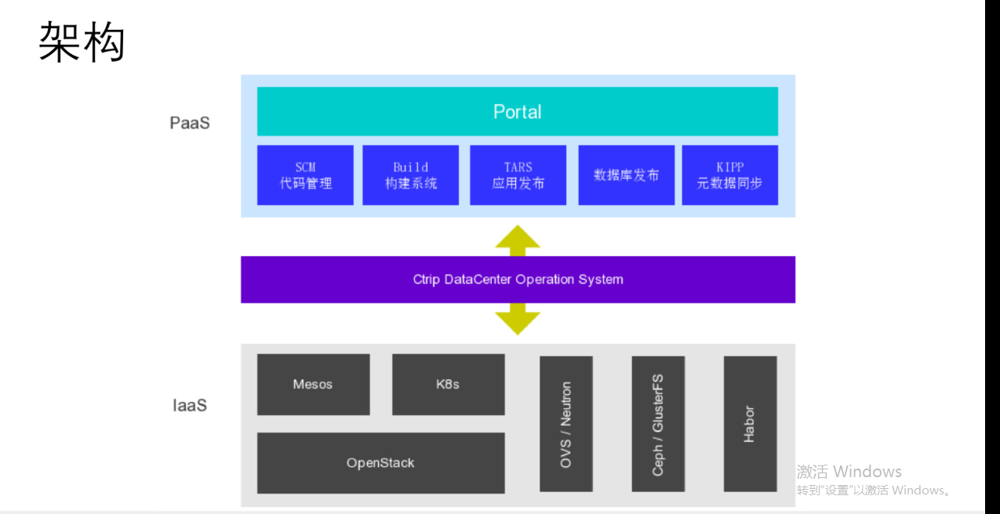
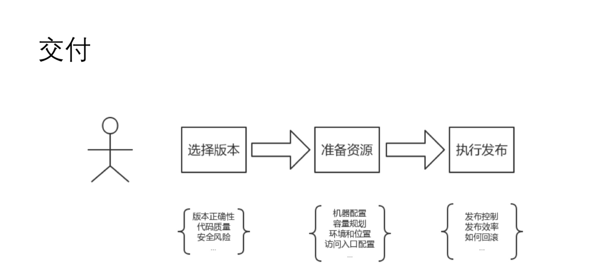
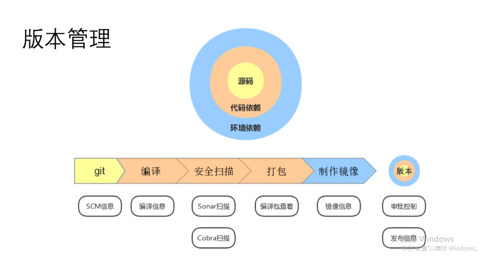
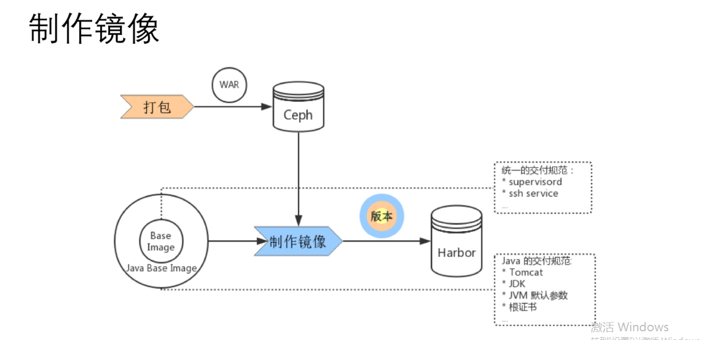
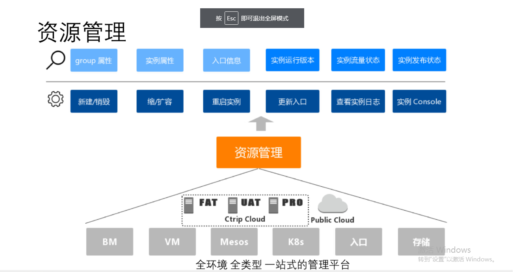

最近订阅了极客时间的学习专栏，很多互联网大厂前沿的技术让自己有了更丰富的视角。。

更好的学习方式一定要有反思，不要以为看了一遍，就感觉自己好像就理解，明白了。要有复盘的习惯，另外对于新技术的理解要有一个思维框架，任何技术都会有演化的路径，一个新技术的出现一定是为了解决某个特定场景的问题，所以什么场景，什么问题，是否有其他对标方案，他们之间的优劣势等都需要有充分了解。

# 背景

携程的研发经理，大浪

携程容器平台的变迁

#业务面对的痛点

解决交付流程中的环境依赖问题，提高交付效率，

# 关键技术

同一个版本代码，面对不同应用场景（比如测试环境，生产环境），所需的依赖环境不一样（比如测试环境会需要docker image中安装测试需要的一些包，但是生产环境不需要这些包），所以 通过在 docker file的结尾，根据不同场景赖环境，但是 代码是同一份

# 可储备（参考）技术

- logview集成（适用生产环境中，不能通过console登陆，又需要查看日志的情况）

- 发布管理中的一些特殊场景（发布的影响因子，通过梳理出影响因子，组合这些影响因子，从而适配场景的要求：比如 降级发布，紧急发布，）

- 容器images的缓存策略，增加pull images 效率

- docker images harbor仓库

  多 harbor仓库之间的同步

  镜像回源的解决方案

- mesos迁移到k8s实践

  mesos问题：

  无状态应用

  手动扩容

- 通过cgroup notification 获取到 oom的信息

  ​

# 携程pass平台介绍

IaaS平台中有虚拟化环境，也有物理机，并且采用了ceph，mesos最终迁移到K8s，k8s跑在了vm上

为了屏蔽Iaas层的一些异构架构的复杂性，加了一层抽象（美其名为数据中心操作系统，京东也有类似）

 目前该平台支撑9000个应用（60%为容器）， 3000+ 研发人员。

##交付流程 

3个核心点，针对3个点，引出3个方面的展开内容

从代码的交付转变到容器image交付

##版本管理

### docker images 

2层镜像：

基础images：（独立于语言，

与技术栈相关的image

images 以dockfile方式

多环境docker image问题？？（服务集市）

docker file动态注入 依赖

## 资源管理

日志集成：

应用的日志，容器日志，

tomacat

gc

生产环境不允许console登陆，logview组件去查看和下载

### 容器images 管理

one region one cluster

多harbor集群的同步

本身功能的限制（单写多读）

fedoro的联邦结构

可以控制同步的粒度。。

镜像回源的解决方案

## 交付管理

# 参考文档

携程的redis 容器化

<https://blog.csdn.net/m2l0zgssvc7r69efdtj/article/details/85811398>

原文的ppt参考连接

<https://myslide.cn/slides/16117#>

