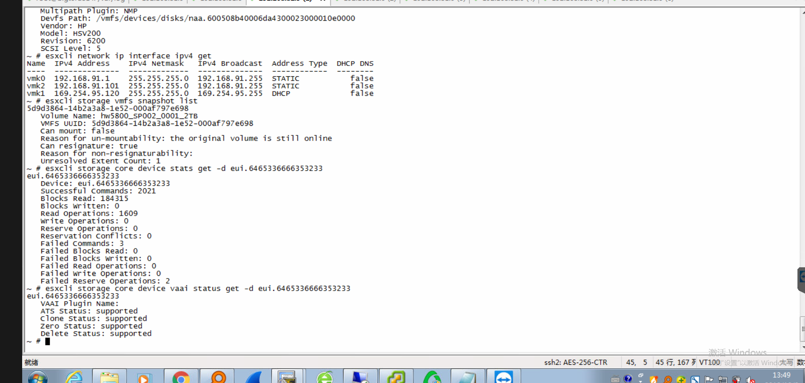

# 故障现象

```
                          
2019-10-08T07:10:25.198Z cpu13:35761 opID=e02aea1b)Partition: 423: Failed read for "eui.6465336666353233": I/O error                                                  
2019-10-08T07:10:25.198Z cpu13:35761 opID=e02aea1b)Partition: 1003: Failed to read protective mbr on "eui.6465336666353233" : I/O error                               
2019-10-08T07:10:25.198Z cpu13:35761 opID=e02aea1b)WARNING: Partition: 1112: Partition table read from device eui.6465336666353233 failed: I/O error                  
2019-10-08T07:10:25.198Z cpu13:35761 opID=e02aea1b)Vol3: 785: Could not open device 'eui.6465336666353233:1' for volume open: No such partition on target             
2019-10-08T07:10:25.198Z cpu13:35761 opID=e02aea1b)Vol3: 2790: Failed to get object 28 type 1 uuid 5a9d48e2-f2d01afa-cc00-000af797e698 FD 0 gen 0 :No such partition on
2019-10-08T07:10:25.198Z cpu13:35761 opID=e02aea1b)WARNING: Fil3: 2415: Failed to reserve volume f530 28 1 5a9d48e2 f2d01afa a00cc00 98e697f7 0 0 0 0 0 0 0           
2019-10-08T07:10:25.198Z cpu13:35761 opID=e02aea1b)Vol3: 2790: Failed to get object 28 type 2 uuid 5a9d48e2-f2d01afa-cc00-000af797e698 FD 4 gen 1 :No such partition on
2019-10-08T07:10:48.777Z cpu17:44991579)NMP: nmp_ThrottleLogForDevice:2458: Cmd 0x84 (0x41330179b3c0, 0) to dev "eui.3939303832313261" on path "vmhba32:C0:T0:L12" Fail
2019-10-08T07:10:48.777Z cpu17:44991579)WARNING: NMP: nmp_DeviceRequestFastDeviceProbe:237: NMP 


2019-10-08T07:11:05.203Z cpu14:44997166)Vol3: 731: Couldn't read volume header from eui.3939303832313261:1: Timeout


```


# 处理过程

iscsi的客户端和服务端都尝试过重启，现象还是一样。

检查esx 的该lun scsi 操作统计中可以看到失败的命令统计



另外，esx 日志中看起来有超时的记录，联想到lun是在多台ESX主机之间共享的，lun的共享有专门的机制（reserve和release），SCSI-2和SCSI-3机制有些区别，详见后面的知识点记录。 所以怀疑是否是lun 的 lock出现问题了。

为了验证上面的怀疑，我们通过 一台linux系统挂载了该lun，手动 执行 SCSI的命令，模拟 lun的 reserve 动作，但是命令每次都是 40s的超时，然后失败返回。 基本和esx的日志吻合，lun已经无法正常响应reserve的命令。


所以，现在问题就定位在 为啥 lun无法响应 reserve 指令了。 lun的服务是由 内核模块 SCST提供，所以 现在需要知道 SCST 怎么了，只能打开内核 dynamic debug


## 内核的dynamic debug

首先通过 SCST的源码，找到关于 reserve和release相关的函数

SCST的源码，可以看到 reserve函数提供了 pr_debug（待确认这个pr_debug 是不是 内核专门预留给 debug 用的？？）

```
532 static inline void scst_reserve_dev(struct scst_device *dev,
533                     struct scst_session *sess)
534 {
535     EXTRACHECKS_BUG_ON(sess == NULL);
536     pr_debug("Old Holder: %p, New Holder: %p\n", dev->reserved_by, sess);
537     dev->reserved_by = sess;                                                                                                                                                                                                            
538 }


```


通过 dynamic_debug打开的debug

> 该接口 提供了很多 可以debug的函数，可以 vim 找到需要的函数。

```
echo "func scst_clear_dev_reservation +lptf" > /sys/kernel/debug/dynamic_debug/control
echo "func scst_reserve_dev +lptf" > /sys/kernel/debug/dynamic_debug/control


```


通过sg相关的命令模拟 reserve指令（命令加 time 前缀，方便统计命令响应时间。）

```
sg_raw /dev/sdX 16 00 00 00 00 00 (Reserve)
sg_raw /dev/sdX 17 00 00 00 00 00 (Release)

命令效果（lab模拟）
root@wsg-70-3:~# time sg_raw /dev/sdd 16 00 00 00 00 00
>>> unknown pass through result category (1)
SCSI Status: Reservation Conflict 


real	0m0.001s
user	0m0.003s
sys	0m0.001s

```

测试过程中发现，每次尝试去 reserve lun时，time统计的时间都是40s，正常情况下，reserve 指令应该很快就会返回。 看起来40s 应该是 软件上面的某个超时机制。考虑到底层为RBD，所以想到rbd的锁机制 和rbd header有关系。

于是，检查该rbd header的watcher，发现rbd header 竟然存在了2个 watcher （正常应该是一个watcher）。此时联想到该集群在 前几天，同事处理过osd leveldb膨胀问题，导致过集群长时间处于down+peering状态。

所以现在的问题转换为 如何删除这个 多出来的rbd header watcher

## 删除rbd header watcher

通过backlist的方式来删除，方法如下：

```
  
  列出 rbd header watcher
  rados -p rbd listwatchers rbd_header.7mjm6dk28jaj3
  
  将有问题的 watcher 加入blacklist
  ceph osd blacklist add 1.1.2.1:0/1193546917
  
  检查 watcher 是否还存在，删除之后 再恢复 blacklist
  ceph osd blacklist rm 1.1.2.1:0/119354691
  
  检查blacklist 情况，确保已经恢复到初始状态
  ceph osd blacklist ls
  
```


删除 watcher 之后，sg 模拟的 reserver命令立刻就返回了。

检查esx端，恢复正常。

# 总结

giant版本的rbd header watcher 在某些情况下（本次的情况是 集群出现过长时间的down+peering状态），可能不会自动释放，导致同一个rbd header 产生了多个 watcher，从而导致 scst层面的reserve 指令返回时间过长。 在 esx层面，表现为 对 iscsi lun 的设备加锁超时失败。


# 知识点记录


## scst的debug 调整

```
cat /sys/kernel/scst_tgt/trace_level


恢复debug
echo "default" > /sys/kernel/scst_tgt/trace_level
```


## iscsi lun的共享机制

通常来讲目前SCSI锁有两种类型：SCSI-2Reservation和SCSI-3 Reservation，这里SCSI-3Reservation也称之为Persistent Reservation。这两种类型的的锁是不能共存在一个Lun上的。

SCSI-2 Reservation只允许设备被发出加锁的Initiator访问，这里Initiator一般指HBA。比如HostA上的fcs0对访问的LUN加上SCSI-2锁，此时即使HostA上的fcs1也无法访问该Lun。所以SCSI-2 Reservation有时也被称为single-pathreservation。

SCSI-3 Reservation（PersistentReservation）是使用PR Key来对设备进行加锁。通常一台Host会有唯一的PR Key，不同的host，PRKey也不同。所以一般SCSI-3 Reservation通常被应用在多通路的共享环境下面。


## 内核的dynamic debug

准备后面会单独 写一篇 专门的文章，


scst的 reserv

```
echo "func scst_clear_dev_reservation =" > /sys/kernel/debug/dynamic_debug/control
echo "func scst_reserve_dev =" > /sys/kernel/debug/dynamic_debug/control

加选项
echo "func scst_clear_dev_reservation +lptf" > /sys/kernel/debug/dynamic_debug/control
echo "func scst_reserve_dev +lptf" > /sys/kernel/debug/dynamic_debug/control


kern.log
Oct 14 17:18:28 wsg-70-3 kernel: [356969.436003] [82419] scst_reserve_dev:536: Old Holder:           (null), New Holder: ffff88011c870000
Oct 14 17:18:36 wsg-70-3 kernel: [356976.954242] [263065]: scst: scst_set_cmd_error_status:1698:Reservation conflict (dev tgt0_0, initiator iqn.1993-08.org.debian:01:6997c6813639, tgt_id 1)
Oct 14 17:18:36 wsg-70-3 kernel: [356976.954273] sd 3:0:0:0: reservation conflict


```


## esx的 存储相关命令

### 查看所有 datastore

```
[root@localhost:~]  esxcli storage filesystem list
Mount Point                                        Volume Name         UUID                                 Mounted  Type              Size            Free
-------------------------------------------------  ------------------  -----------------------------------  -------  ------  --------------  --------------
/vmfs/volumes/2707af93-17b6f4d4                    124-share           2707af93-17b6f4d4                       true  NFS     40008333393920  12798507614208
/vmfs/volumes/595d1290-79d25d9f-5c14-00e0ed438c52  datastore1          595d1290-79d25d9f-5c14-00e0ed438c52     true  VMFS-5    231928233984    123346092032
/vmfs/volumes/5ce3ae6c-2f1dbf04-bb3b-00e0ed438c52  Presale-lun-v7-new  5ce3ae6c-2f1dbf04-bb3b-00e0ed438c52     true  VMFS-5   6596801331200   5780643250176
/vmfs/volumes/5d06eb1f-f5cc5f8b-4ebc-00e0ed438c52  SEG-LUN             5d06eb1f-f5cc5f8b-4ebc-00e0ed438c52     true  VMFS-5  21989964120064   4672265912320
/vmfs/volumes/5b8fa879-70bdee41-4848-00e0ed438c4e  QA-lun-v7           5b8fa879-70bdee41-4848-00e0ed438c4e     true  VMFS-5  10994847842304   1681623351296
/vmfs/volumes/5a680f37-6036095e-cb6b-00e0ed438c52                      5a680f37-6036095e-cb6b-00e0ed438c52     true  vfat        4293591040      4255121408
/vmfs/volumes/7d3b9479-6b478943-643a-5a641dfcbd57                      7d3b9479-6b478943-643a-5a641dfcbd57     true  vfat         261853184        75464704

```


### 查看vmfs的 datastore

```
[root@localhost:~] esxcli storage vmfs extent list
Volume Name         VMFS UUID                            Extent Number  Device Name                                                               Partition
------------------  -----------------------------------  -------------  ------------------------------------------------------------------------  ---------
datastore1          595d1290-79d25d9f-5c14-00e0ed438c52              0  t10.ATA_____INTEL_SSDSC2BB240G4_____________________BTWL30940045240MGN__          3
Presale-lun-v7-new  5ce3ae6c-2f1dbf04-bb3b-00e0ed438c52              0  eui.d8d980790ba184f2                                                              1
SEG-LUN             5d06eb1f-f5cc5f8b-4ebc-00e0ed438c52              0  eui.99e91f03b82de449                                                              1
QA-lun-v7           5b8fa879-70bdee41-4848-00e0ed438c4e              0  eui.ea3fcd1f5424a6f3                                                              1

```


## 查看lun的统计

```
[root@localhost:~] esxcli storage core device stats get -d eui.99e91f03b82de449
eui.99e91f03b82de449
   Device: eui.99e91f03b82de449
   Successful Commands: 437865323
   Blocks Read: 2390925674
   Blocks Written: 25340206445
   Read Operations: 31367192
   Write Operations: 404557595
   Reserve Operations: 0
   Reservation Conflicts: 0
   Failed Commands: 85
   Failed Blocks Read: 512
   Failed Blocks Written: 0
   Failed Read Operations: 1
   Failed Write Operations: 52
   Failed Reserve Operations: 0
[root@localhost:~] 


```


## 进程的暂停和 开始

```
       SIGCONT   19,18,25    Cont    Continue if stopped
       SIGSTOP   17,19,23    Stop    Stop process
       
       


    Linux supports both POSIX reliable signals (hereinafter "standard
       signals") and POSIX real-time signals.

   Standard signals

       First the signals described in the original POSIX.1-1990 standard.

       Signal     Value     Action   Comment
       ───────────────────────────────────
       SIGHUP        1       Term    Hangup detected on controlling terminal
                                     or death of controlling process
       SIGINT        2       Term    Interrupt from keyboard
       SIGQUIT       3       Core    Quit from keyboard
       SIGILL        4       Core    Illegal Instruction
       SIGABRT       6       Core    Abort signal from abort(3)
       SIGFPE        8       Core    Floating point exception
       SIGKILL       9       Term    Kill signal
       SIGSEGV      11       Core    Invalid memory reference
       SIGPIPE      13       Term    Broken pipe: write to pipe with no
                                     readers
       SIGALRM      14       Term    Timer signal from alarm(2)
       SIGTERM      15       Term    Termination signal
       SIGUSR1   30,10,16    Term    User-defined signal 1
       SIGUSR2   31,12,17    Term    User-defined signal 2
       SIGCHLD   20,17,18    Ign     Child stopped or terminated
       SIGCONT   19,18,25    Cont    Continue if stopped
       SIGSTOP   17,19,23    Stop    Stop process
       SIGTSTP   18,20,24    Stop    Stop typed at terminal
       SIGTTIN   21,21,26    Stop    Terminal input for background process
       SIGTTOU   22,22,27    Stop    Terminal output for background process

       
```


## sg 工具包


```
root@node2:/usr/lib/cgi-bin/ezs3# dpkg -S /usr/bin/sginfo
sg3-utils: /usr/bin/sginfo

root@node2:/usr/lib/cgi-bin/ezs3# dpkg -l |grep sg3
ii  sg3-utils                            1.39-1                                     amd64        utilities for devices using the SCSI command set
root@node2:/usr/lib/cgi-bin/ezs3# 


```


### PR()

因為SCSI-2 RESERVE/RELEASE Command已經過時了，後來都是用SCSI-3開始定義的PR (Persistent Reserve)。

所以sg utils裡面也就沒有這兩個command的tool，要手動用sg_raw來打了

```
root@wsg-70-2:~# time sg_raw /dev/sdd 16 00 00 00 00 00
SCSI Status: Good 


real	0m0.030s
user	0m0.005s
sys	0m0.002s


root@wsg-70-2:~# time sg_raw /dev/sdd 17 00 00 00 00 00
SCSI Status: Good 


real	0m0.079s
user	0m0.000s
sys	0m0.002s
root@wsg-70-2:~# 


```


### lab 模拟lun的reserve 和release


sg_raw /dev/sdX 16 00 00 00 00 00 (Reserve)

sg_raw /dev/sdX 17 00 00 00 00 00 (Release)


2个 客户端 （node1和node2）同时 iscsi挂载上 同一个lun

 

reserve

```
node1 首先 对lun reserve
root@wsg-70-2:~# sg_raw /dev/sdd 16 00 00 00 00 00
SCSI Status: Good 

root@wsg-70-2:~# 


此时，node2 也尝试reserve，报错
root@wsg-70-3:~# sg_raw /dev/sdd 16 00 00 00 00 00
>>> unknown pass through result category (1)
SCSI Status: Reservation Conflict 

root@wsg-70-3:~# 


```


如果此时  node1 上，将 上面的reserve 释放掉

```
root@wsg-70-2:~# sg_raw /dev/sdd 17 00 00 00 00 00
SCSI Status: Good 

root@wsg-70-2:~# 


此时 ，node2 再次尝试 reserve，就可以顺利完成了
root@wsg-70-3:~# sg_raw /dev/sdd 16 00 00 00 00 00
SCSI Status: Good 

root@wsg-70-3:~# 

```


### scsi命令读数据

```
root@wsg-70-2:~# sg_raw -r 1k /dev/sdd 12 00 00 00 60 00
SCSI Status: Good 

Received 66 bytes of data:
 00     00 00 06 02 3d 08 10 02  42 69 67 74 65 72 61 20    ....=...Bigtera 
 10     56 69 72 74 75 61 6c 53  74 6f 72 5f 53 63 61 6c    VirtualStor_Scal
 20     30 37 30 30 00 00 00 00  00 00 00 00 00 00 00 00    0700............
 30     00 00 00 00 00 00 00 00  00 00 00 8b 09 60 04 63    .............`.c
 40     04 c0                                               ..
root@wsg-70-2:~# 


sdc是vm中 虚拟磁盘
root@wsg-70-2:~# sg_raw -r 1k /dev/sdc 12 00 00 00 60 00
SCSI Status: Good 

Received 36 bytes of data:
 00     00 00 02 02 1f 00 00 73  56 4d 77 61 72 65 20 20    .......sVMware  
 10     56 69 72 74 75 61 6c 20  64 69 73 6b 20 20 20 20    Virtual disk    
 20     31 2e 30 20                                         1.0 
root@wsg-70-2:~# 

```


# 参考


<https://linux.die.net/man/8/sg3_utils>


<https://kb.netapp.com/app/answers/answer_view/a_id/1001463/~/what-are-scsi-reservations-and-scsi-persistent-reservations%3F->


