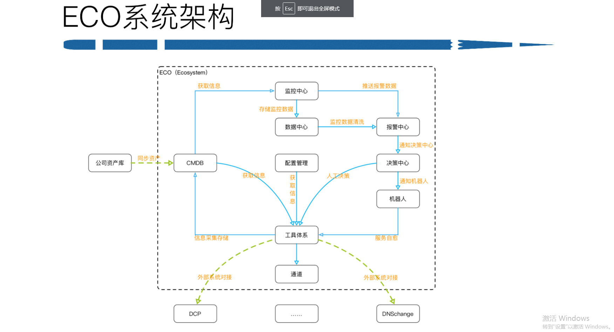

# 背景

产品运维

拥抱快速变化

刘然，2011年加入微博，

微博平台架构

openAPI 转化为微博平台

# 业务架构

报警 ：贯穿 全部体系，监控和告警拆分

传统 ：脚本运维

#中控平台

产品经理思维 规划运维平台

系统可用性，易用性，

ECO

CMDB 产品属性（服务属性），和传统区别

决策中心： 同样的问题可以沉淀下来，不要处理重复的问题

### DCP 混合云

###扩容案例

痛点，

解决方案

阿里云 slb，单slb 断连

 

## 公有云实践

150G 专线， 自己机房到 阿里机房

一半服务在 阿里云

私有云

