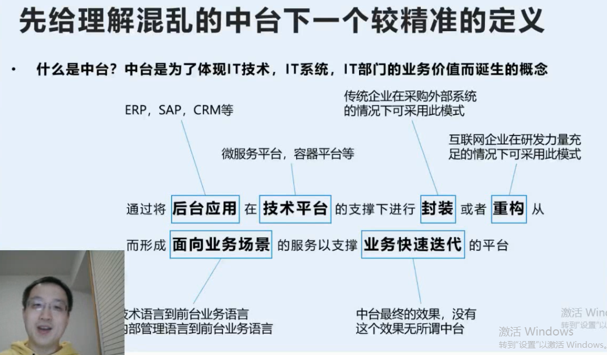
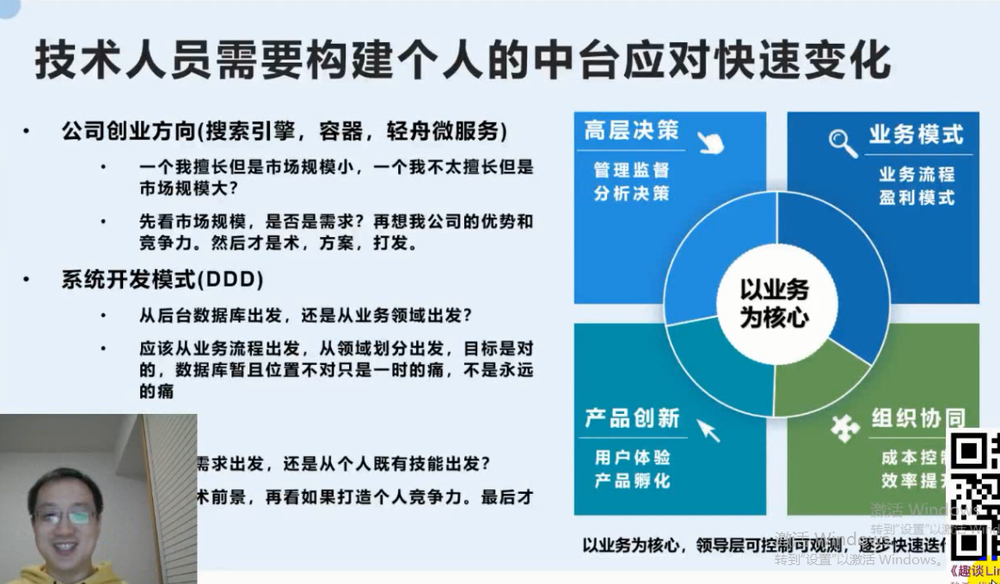
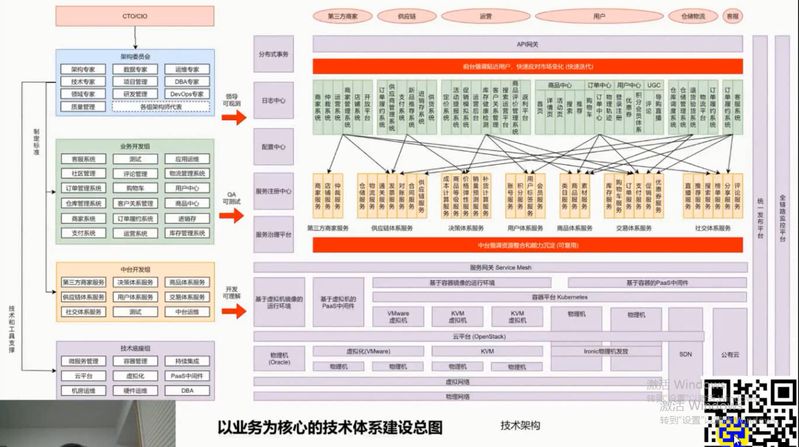
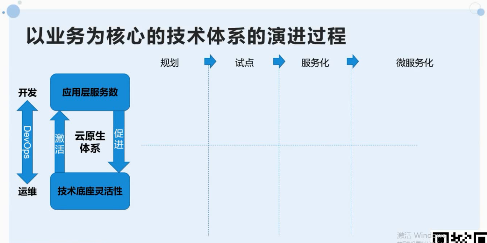

# 背景

刘超，原来在EMC做分布式存储，极客时间开设了2门专栏： 趣谈网络协议和趣谈linux操作系统

# 启发

虽然中台的概念在互联网等线上平台比较火，但是和个人相结合的角度还是比较新颖和贴地气的

# 内容-企业和个人技术体系建设

## 中台 引入 个人中台的概念

中台 是业务

## 未来的技术架构

### 架构的演化

## 个人技术体系建设

- 技术前景——看市场需求
- 打造个人核心竞争力——参与核心项目
- 积淀中台能力——有意识构建可复用能力

