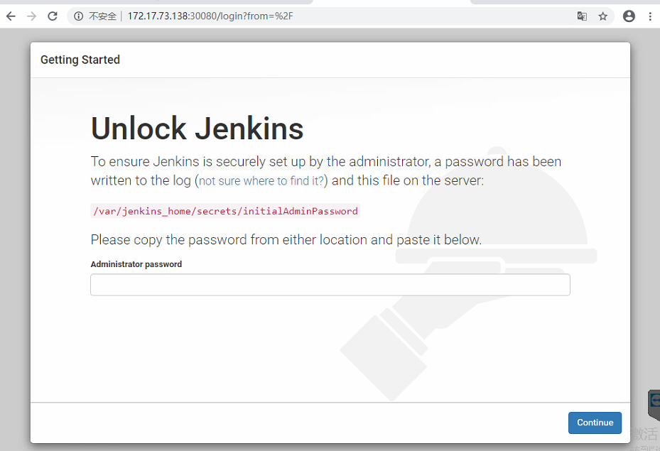

# 背景

尝试通过在 k8s环境部署jenkins的持续集成环境，我们的目标是 产出包含linux-kernel的一个可以安装的ISO包。

考虑到k8s 生态已经有现成的jenkins docker image，免除了配置的烦恼。首先尝试了 基于helm的jenkins安装包，但是使用后发现pv的绑定一直有些问题。后来采用了手动创建k8s 编排对象的方式（编写yaml文件）来创建jenkis服务。（具体内容可以参考github链接：https://github.com/jamesWsg/myown/tree/master/kubernets_ymal/jenkins-server）。

原来打算build环境也做成容器的方式，方便后续管理，但是发现dockerfile在build image时，因为安装grub需要手动选择，无法正常build出镜像（通过启动容器，再安装grub和其他依赖的包可以避免该问题，但是在build ceph的过程中 c++编译器会报错退出，详见文档最后的附录，所以容器的路子就不可行了）。

所以，本次jenkins部署的方式为 server端部署在k8s 容器中，具体负责build任务的work-node放在vm上（vm的资源不能太少，台湾build环境是32核，32G），所以本文主要包括jenkins server部署和work-node部署，详细过程整理如下


## jenkins server部署

> 注意，在 删除部署后，pv资源不会释放，需要手动删除pv 资源。


- 准备k8s 配置文件

  主要包括 pv和pvc 配置文件，考虑到jenkins需要对外提供服务，可以采用NodePort的方式。编排对象目前采用的是deployment，声明nfs的存储空间，所有文件已经放到了github目录供后续参考

  <https://github.com/jamesWsg/myown/tree/master/kubernets_ymal/jenkins-server>

  ```
  wsg@ubuntu16:~/helm/jenkins/aliyun$ ll
  total 44
  drwxrwxr-x 2 wsg wsg 4096 Feb 14 19:35 ./
  drwxrwxr-x 5 wsg wsg 4096 Feb  9 14:57 ../
  -rw-rw-r-- 1 wsg wsg 9965 Feb  9 17:19 iptable_export
  -rw-rw-r-- 1 wsg wsg 9965 Feb  9 17:38 iptable_export_new
  -rw-rw-r-- 1 wsg wsg 1297 Feb 11 13:15 jenkins_nodePort.yml
  -rw-rw-r-- 1 wsg wsg 1309 Feb  9 14:58 jenkins.yml
  -rw-rw-r-- 1 wsg wsg  284 Feb 11 12:56 pv.yml
  wsg@ubuntu16:~/helm/jenkins/aliyun$ pwd
  /home/wsg/helm/jenkins/aliyun
  wsg@ubuntu16:~/helm/jenkins/aliyun$ 
  pv.yml 内容如下： pv的名字为 jenkins-new，是一个 nfs
    apiVersion: v1
    kind: PersistentVolume
    metadata:
      name: jenkins-new
      namespace: ci
    spec:
      capacity:
        storage: 500Gi
      accessModes:
        - ReadWriteMany
      persistentVolumeReclaimPolicy: Retain
      nfs:
        server: 172.17.73.38
        path: /vol/kubernet-nfs
  ```


  阿里云 最新的 jenkins版本：Jenkins 2.46.2
  配置文件中 采用的jenkins镜像为image: jenkins/jenkins:2.204（从官方镜像库pull，可以替换为更新的版本。）

  ```

  ​

- apply上面配置文件

  因为上面的配置文件中，都声明在了 ci namespce，所以需要提前创建该 命名空间

  ```
  wsg@ubuntu16:~/helm/jenkins/aliyun$ kubectl create namespace ci
  namespace/ci created

  kubectl apply -f pv.yml
  kubectl apply -f jenkins_nodePort.yml

  ```

  ​

- 检查配置生效情况

  检查pv情况，看起来pv 并没有分 namespace

  ```

  wsg@ubuntu16:~/helm/jenkins/aliyun$ kubectl -n ci get pv
  NAME                    CAPACITY   ACCESS MODES   RECLAIM POLICY   STATUS        CLAIM                                                                                                      STORAGECLASS    REASON   AGE
  jenkins                 5Gi        RWX            Retain           Terminating   ci/jenkins                                                                                                                          18d
  jenkins-new             500Gi      RWX            Retain           Bound         ci/jenkins-new                                                                                                                      16d
  local-pv                200Gi      RWO            Retain           Bound         default/prometheus-wsg-prometheus-operator-prometheus-db-prometheus-wsg-prometheus-operator-prometheus-0   local-storage            51d
  wsg-nfs-prometheus-pv   100Gi      RWO            Retain           Released      default/prometheus-wsg-prometheus-operator-prometheus-db-prometheus-wsg-prometheus-operator-prometheus-0   manual                   52d
  wsg@ubuntu16:~/helm/jenkins/aliyun$ 

  ```

  检查pod 和service 情况

  ```
  wsg@ubuntu16:~/helm/jenkins/aliyun$ kubectl -n ci get pod
  NAME                       READY   STATUS        RESTARTS   AGE
  jenkins-bd446b4f-cwqw7     1/1     Running       0          11d
  wsg@ubuntu16:~/helm/jenkins/aliyun$ 
  wsg@ubuntu16:~/helm/jenkins/aliyun$ kubectl -n ci get service
  NAME          TYPE       CLUSTER-IP       EXTERNAL-IP   PORT(S)                        AGE
  jenkins-svc   NodePort   10.105.253.167   <none>        80:30080/TCP,50000:30436/TCP   16d
  wsg@ubuntu16:~/helm/jenkins/aliyun$ 

  ```

  可以进一步查看service 的endpoint

  ```
  wsg@ubuntu16:~/helm/jenkins/aliyun$ kubectl -n ci get ep jenkins-svc
  NAME          ENDPOINTS                          AGE
  jenkins-svc   10.32.0.59:8080,10.32.0.59:50000   16d
  wsg@ubuntu16:~/helm/jenkins/aliyun$ 

  ```

- jenkins pod运行正常后，就可以进行初始化 jenkins服务了，通过nodePort定义的端口。密码文件位于 jenkins pod的 persistent volume（这里是 nfs挂载点）,通过下面的密码登陆后，进行相关的初始化（创建管理用户，选择安装的插件，插件联网安装，速度比较慢。）

  ```
  root@node3:/var/share/ezfs/shareroot/kubernet-nfs/secrets# ll
  total 4
  drwx------ 1 root root     4237 Feb  9 16:31 ./
  drwxrwxrwx 1 root root 81715926 Feb  9 18:53 ../
  drwxr-xr-x 1 root root     2312 Feb  9 16:31 filepath-filters.d/
  -rw-r--r-- 1 root root       48 Feb  9 16:31 hudson.console.ConsoleNote.MAC
  -rw-r--r-- 1 root root      272 Feb  9 16:31 hudson.util.Secret
  -rw-r----- 1 root root       33 Feb  9 16:31 initialAdminPassword
  -rw-r--r-- 1 root root       32 Feb  9 16:31 jenkins.model.Jenkins.crumbSalt
  -rw-r--r-- 1 root root       48 Feb  9 16:31 jenkins.security.ApiTokenProperty.seed
  -rw-r--r-- 1 root root      256 Feb  9 16:31 master.key
  -rw-r--r-- 1 root root      272 Feb  9 16:31 org.jenkinsci.main.modules.instance_identity.InstanceIdentity.KEY
  -rw-r--r-- 1 root root        5 Feb  9 16:31 slave-to-master-security-kill-switch
  drwxr-xr-x 1 root root      959 Feb  9 16:31 whitelisted-callables.d/
  root@node3:/var/share/ezfs/shareroot/kubernet-nfs/secrets# cat initialAdminPassword 
  84b71054ff7b41d29c4b8631cf944b45
  root@node3:/var/share/ezfs/shareroot/kubernet-nfs/secrets# 
  ```

  ​

  


## jenkins增加work-node

完成上面的jenkins 配置后，就可以配置work-node，work-node的环境才是真正的编译环境，它会从 jenkins server收到编译的任务。work-node和server端之间的通讯可以通过ssh和jnlp，文章最后也会给出基于容器的work-node的部署方法，这里主要记录基于vm的work-node 部署方式。ssh方式 本质上 是jenkins server通过ssh的方式，将 agent.jar 包 传输到 work-node节点，然后通过work-node的java环境，执行该jar包，最终实现和server端的jnlp通讯。


> 注意：build 环境 至少需要 18G的内存，CPU 16核，（测试 用8G的内存 会失败），所以work-node节点也需要达到该要求。
>
> 

- work-node 是基于开源ubuntu14，需要java8的环境，实现和jenkins server 通讯

  ```
  安装java8 的步骤，这里使用了ppa的repository

  sudo add-apt-repository ppa:openjdk-r/ppa
  sudo apt-get update
  sudo apt-get install openjdk-8-jdk


  wsg@ubuntu14:/mnt/GIT-iscsi/GIT/virtualstor-7.0$ sudo update-alternatives --config java
  [sudo] password for wsg: 
  There are 2 choices for the alternative java (providing /usr/bin/java).

    Selection    Path                                            Priority   Status
------------------------------------------------------------
  * 0            /usr/lib/jvm/java-7-openjdk-amd64/jre/bin/java   1071      auto mode
    1            /usr/lib/jvm/java-7-openjdk-amd64/jre/bin/java   1071      manual mode
    2            /usr/lib/jvm/java-8-openjdk-amd64/jre/bin/java   1069      manual mode

  Press enter to keep the current choice[*], or type selection number:     


  ```

  ​


- work-node的相关环境变量汇总

  另外，需要安装的编译依赖包很多，通过在tw机器上扣取了所有的包信息（近2千个deb包），也放在了github上，方便后续

  https://github.com/jamesWsg/myown/tree/master/docker-file/ubuntu14_build_env/

  ```

  git仓库为iscsi lun，挂载路径如下：
  wsg@ubuntu14:/mnt/GIT-iscsi/GIT/virtualstor-7.0$ 

  创建java的链接，
  wsg@ubuntu14:~/workspace$ ll /usr/local/bin/java 
  lrwxrwxrwx 1 root root 46 Feb 28 14:34 /usr/local/bin/java -> /usr/lib/jvm/java-8-openjdk-amd64/jre/bin/java*
  wsg@ubuntu14:~/workspace$ 

  ```

  有了上面的java 环境，就可以在 jenkins server端增加该work-node

  

  ​

- jenkins 配置pipeline

  需要指定该pipeline的执行节点，默认是放在master 节点，因为这里专门准备了work-node，需要指定到该node（通过创建node时设置的label来指定，上一步我们指定了label为iso）。目前所有pipeline（free style）中照搬了台北的配置，后续可以将pipeline改进为jenkinsfile，这样避免后续通过ui的繁琐配置，同时可以将 jeninsfile加入git仓库进行管理。

- 执行pipeline

  配置完成后，就可以正常执行pipeline。因为该pipeline过程中有pull git 仓库的过程，耗时比较久，所以一般提前在该 work-node上提前pull好对应的代码。后面章节会 单独说明。

  


## git 仓库准备

虽然上面执行pipeline 的过程中，会自动

git 的配置参考（.gitconfig文件），ssh key拷贝到对应位置（仓库已经添加好的key）

  ```
完成上面的jenkins 配置后，就可以
manu-Inspiron-5748 ~ » cat .gitconfig 
[user]
	email = ####
	name = shengguo
[core]
	editor = vim
[filter "lfs"]
	clean = git-lfs clean -- %f
	smudge = git-lfs smudge --skip -- %f
	process = git-lfs filter-process --skip
	required = true

```


- 拉取我们的代码，（包括 ezs3-ceph和 linux kernel submoudle）


- checkout 到对应的分支
- git lfs fetch 补全所有文件
- 注意submoudule的HEAD 位置（一般主git checkout到7.0版本就可以了）
- ​


 

# 知识点记录

## build docker image 相关

一开始，打算将work-node环境也放在容器中，但是发现dockerfile在build image时，因为安装grub需要手动选择，无法正常build出镜像。通过启动容器，再安装grub和其他依赖的包可以避免该问题，但是在build ceph的过程中 c++编译器会报错退出，详见文档最后的附录，所以容器的路子就不可行了。

但是该过程也积累了关于dockfile相关的知识，所以相关代码整理了放在 github中供 后续参考。

<https://github.com/jamesWsg/myown/tree/master/docker-file/ubuntu14_build_env/ubuntu>

相关的知识点概况如下：

- dockerfile中apt-get安装几百个deb时的换行方法
- dockerfile中增加文件和文件夹
- dockerfile中dpkg命令
- dockerfile中执行bash命令
- apt-get source的gpg key配置

需要 安装 git 的新版本，git-lfs，libzfs，第三方的repository

docker image build过程中增加了 source.list 文件，repo的gpg key，git的配置文件，ssh key文件，

docker file 的git hub仓库


## jenkins pipeline 配置

配置的pipeline 会在 workspace 目录生成 pipeline name的目录，该目录 内会创建 该pipline 配置的git 仓库

jenkins虽然会自动帮你拉对应的git仓库，但是耗时比较久，如果有提前pull好的仓库，也可以直接在workspace 创建软连接，链接到提前拉好的仓库。

本次测试就是软链接到 提前拉好的仓库

```
wsg@ubuntu14:~/workspace$ ll
total 12
drwxrwxr-x  3 wsg wsg 4096 Feb 29 09:06 ./
drwxr-xr-x 16 wsg wsg 4096 Feb 29 11:13 ../
drwxrwxr-x  3 wsg wsg 4096 Feb 28 16:05 virtualstor_converger_7.0/
lrwxrwxrwx  1 wsg wsg   35 Feb 29 09:06 virtualstor_scaler_7.0 -> /mnt/GIT-iscsi/GIT/virtualstor-7.0//
wsg@ubuntu14:~/workspace$ pwd
/home/wsg/workspace
wsg@ubuntu14:~/workspace$ 

```


## jenkins的work-node 类型（ssh，jnlp）

<https://github.com/jenkinsci/ssh-slaves-plugin/blob/master/doc/CONFIGURE.md>


- 基于ssh的方式

  ui上选择 通过ssh方式，增加 worknode的 ssh 用户信息（新加credential），如下

  


- 基于jnlp的方式

```

  官方jnlp docker 镜像中的 java 信息

  jenkins@6e039dbe7379:~/agent$ java -version
  openjdk version "1.8.0_242"
  OpenJDK Runtime Environment (build 1.8.0_242-b08)
  OpenJDK 64-Bit Server VM (build 25.242-b08, mixed mode)
  jenkins@6e039dbe7379:~/agent$ 

  ```

  ​

## 更改 service 类型为 nodePort后

service的原理是通过 kube-proxy 来创建 对应的iptable规则，根据张磊的课程，

  ```
wsg@ubuntu16:~/kube_ymal/pv_pvc$ sudo iptables -L |grep -Ei Chain
Chain INPUT (policy ACCEPT)
Chain FORWARD (policy DROP)
Chain OUTPUT (policy ACCEPT)
Chain DOCKER (1 references)
Chain DOCKER-ISOLATION-STAGE-1 (1 references)
Chain DOCKER-ISOLATION-STAGE-2 (1 references)
Chain DOCKER-USER (1 references)
Chain KUBE-EXTERNAL-SERVICES (1 references)
Chain KUBE-FIREWALL (2 references)
Chain KUBE-FORWARD (1 references)
Chain KUBE-SERVICES (3 references)
Chain WEAVE-NPC (1 references)
Chain WEAVE-NPC-DEFAULT (1 references)
Chain WEAVE-NPC-EGRESS (2 references)
Chain WEAVE-NPC-EGRESS-ACCEPT (8 references)
Chain WEAVE-NPC-EGRESS-CUSTOM (1 references)
Chain WEAVE-NPC-EGRESS-DEFAULT (1 references)
Chain WEAVE-NPC-INGRESS (1 references)
wsg@ubuntu16:~/kube_ymal/pv_pvc$ 
```

## vm build 环境的内核版本虽然有 差异，但是可以正常 build


这次采用的vm 内核版本

```
wsg@ubuntu14:/mnt/GIT-iscsi/GIT/virtualstor$ cat /etc/issue
Ubuntu 14.04.6 LTS \n \l
wsg@ubuntu14:~$ uname -a
Linux ubuntu14 4.4.0-31-generic #50~14.04.1-Ubuntu SMP Wed Jul 13 01:07:32 UTC 2016 x86_64 x86_64 x86_64 GNU/Linux
wsg@ubuntu14:~$ 
```

台湾原来采用的 内核版本

```
bean_li@buildman-trusty:~$ cat /etc/issue
Ubuntu 14.04.4 LTS \n \l
bean_li@buildman-trusty:~$ uname -a
Linux buildman-trusty 3.13.0-32-generic #57-Ubuntu SMP Tue Jul 15 03:51:08 UTC 2014 x86_64 x86_64 x86_64 GNU/Linux
bean_li@buildman-trusty:~$ 
```

## NodePort的语法

- port 必须定义,否则报错如下

```
  ersistentvolumeclaim/jenkins created
  serviceaccount/jenkins created
  clusterrolebinding.rbac.authorization.k8s.io/jenkins created
  deployment.extensions/jenkins created
  error: error validating "jenkins_nodePort.yml": error validating data: [ValidationError(Service.spec.ports[0]): missing required field "port" in io.k8s.api.core.v1.ServicePort, ValidationError(Service.spec.ports[1]): missing required field "port" in io.k8s.api.core.v1.ServicePort]; if you choose to ignore these errors, turn validation off with --validate=false
  wsg@ubuntu16:~/helm/jenkins/aliyun$ ll

  ```

  ​

- nodePort 需要在 指定范围，否则报错如下

  ```
  wsg@ubuntu16:~/helm/jenkins/aliyun$ kubectl apply -f jenkins_nodePort.yml 
  persistentvolumeclaim/jenkins unchanged
  serviceaccount/jenkins unchanged
  clusterrolebinding.rbac.authorization.k8s.io/jenkins unchanged
  deployment.extensions/jenkins unchanged
  The Service "jenkins-svc" is invalid: spec.ports[0].nodePort: Invalid value: 80: provided port is not in the valid range. The range of valid ports is 30000-32767
  wsg@ubuntu16:~/helm/jenkins/aliyun$ 

  ```

# 问题处理记录

## pod无法访问internet

原因是 pod所在host节点的 dns没有配置，具体处理过程记录如下：

pod中是可以和 internet联通，但是 域名无法解析

  ```
wsg@ubuntu16:~/helm/jenkins/aliyun$ kubectl -n ci exec jenkins-5494d984bf-js2kk -- sh -c 'ping -c 10 8.8.8.8'
PING 8.8.8.8 (8.8.8.8): 56 data bytes
64 bytes from 8.8.8.8: icmp_seq=1 ttl=50 time=34.712 ms
64 bytes from 8.8.8.8: icmp_seq=2 ttl=50 time=35.232 ms
64 bytes from 8.8.8.8: icmp_seq=3 ttl=50 time=35.114 ms
64 bytes from 8.8.8.8: icmp_seq=4 ttl=50 time=35.527 ms
64 bytes from 8.8.8.8: icmp_seq=5 ttl=50 time=34.882 ms
64 bytes from 8.8.8.8: icmp_seq=6 ttl=50 time=35.470 ms
64 bytes from 8.8.8.8: icmp_seq=7 ttl=50 time=35.208 ms
64 bytes from 8.8.8.8: icmp_seq=8 ttl=50 time=34.943 ms


访问域名
wsg@ubuntu16:~/helm/jenkins/aliyun$ kubectl -n ci exec jenkins-5494d984bf-js2kk -- sh -c 'curl cn.bing.com'
  % Total    % Received % Xferd  Average Speed   Time    Time     Time  Current
                                 Dload  Upload   Total   Spent    Left  Speed
  0     0    0     0    0     0      0      0 --:--:--  0:00:19 --:--:--     0curl: (6) Could not resolve host: cn.bing.com
command terminated with exit code 6
wsg@ubuntu16:~/helm/jenkins/aliyun$ 

```

但是发现 其他的pod 可以访问 internet

系统pod，位于 master 节点上。coredns pod 2个 不知为啥 都 运行在 master 节点。？？

```

wsg@ubuntu16:~$ kubectl -n kube-system  exec etcd-ubuntu16  -- sh -c 'ping  cn.bing.com'
PING cn.bing.com (202.89.233.101): 56 data bytes
64 bytes from 202.89.233.101: seq=0 ttl=118 time=26.530 ms
64 bytes from 202.89.233.101: seq=1 ttl=118 time=26.321 ms
64 bytes from 202.89.233.101: seq=2 ttl=118 time=26.771 ms
64 bytes from 202.89.233.101: seq=3 ttl=118 time=26.257 ms
64 bytes from 202.89.233.101: seq=4 ttl=118 time=26.493 ms
64 bytes from 202.89.233.101: seq=5 ttl=118 time=26.136 ms
64 bytes from 202.89.233.101: seq=6 ttl=118 time=26.422 ms
64 bytes from 202.89.233.101: seq=7 ttl=118 time=26.570 ms
64 bytes from 202.89.233.101: seq=8 ttl=118 time=26.313 ms
64 bytes from 202.89.233.101: seq=9 ttl=118 time=26.346 ms
64 bytes from 202.89.233.101: seq=10 ttl=118 time=25.904 ms
64 bytes from 202.89.233.101: seq=11 ttl=118 time=26.159 ms
64 bytes from 202.89.233.101: seq=12 ttl=118 time=26.241 ms

wsg@ubuntu16:~$ kubectl -n kube-system  exec etcd-ubuntu16  -- sh -c 'cat /etc/resolv.conf'
nameserver 114.114.114.114
wsg@ubuntu16:~$ kubectl -n kube-system  exec etcd-ubuntu16  -- sh -c 'cat /etc/hosts'
# Kubernetes-managed hosts file (host network).
127.0.0.1	localhost
127.0.1.1	ubuntu16

# The following lines are desirable for IPv6 capable hosts
::1     localhost ip6-localhost ip6-loopback
ff02::1 ip6-allnodes
ff02::2 ip6-allrouters
wsg@ubuntu16:~$ 

```

所以，问题变为 有的 pod上可以访问 internet，有的pod 无法访问。

- 检查pod的host 和resolv.conf配置

```
  wsg@ubuntu16:~/helm/jenkins/aliyun$ kubectl -n ci exec jenkins-5494d984bf-js2kk -- sh -c 'cat /etc/hosts'
  # Kubernetes-managed hosts file.
  127.0.0.1	localhost
  ::1	localhost ip6-localhost ip6-loopback
  fe00::0	ip6-localnet
  fe00::0	ip6-mcastprefix
  fe00::1	ip6-allnodes
  fe00::2	ip6-allrouters
  10.36.0.1	jenkins-5494d984bf-js2kk

  wsg@ubuntu16:~/helm/jenkins/aliyun$ kubectl -n ci exec jenkins-5494d984bf-js2kk -- sh -c 'cat /etc/resolv.conf'
  nameserver 10.96.0.10
  search ci.svc.cluster.local svc.cluster.local cluster.local
  options ndots:5
  ```

- 查看dns pod

  ```
  wsg@ubuntu16:~/helm/jenkins/aliyun$ kubectl get pods --namespace=kube-system -l k8s-app=kube-dns -o wide
  NAME                      READY   STATUS    RESTARTS   AGE    IP           NODE       NOMINATED NODE   READINESS GATES
  coredns-fb8b8dccf-7tjxn   1/1     Running   43         317d   10.32.0.47   ubuntu16   <none>           <none>
  coredns-fb8b8dccf-vdfrb   1/1     Running   43         317d   10.32.0.51   ubuntu16   <none>           <none>
  wsg@ubuntu16:~/helm/jenkins/aliyun$ 
  ```

- 查看pod log

  ```
   wsg@ubuntu16:~/helm/jenkins/aliyun$ kubectl logs --namespace=kube-system coredns-fb8b8dccf-7tjxn
    .:53
    2020-02-04T06:27:52.065Z [INFO] CoreDNS-1.3.1
    2020-02-04T06:27:52.065Z [INFO] linux/amd64, go1.11.4, 6b56a9c
    CoreDNS-1.3.1
    linux/amd64, go1.11.4, 6b56a9c
    2020-02-04T06:27:52.065Z [INFO] plugin/reload: Running configuration MD5 = 599b9eb76b8c147408aed6a0bbe0f669
    wsg@ubuntu16:~/helm/jenkins/aliyun$ 

    wsg@ubuntu16:~/helm/jenkins/aliyun$ 
    wsg@ubuntu16:~/helm/jenkins/aliyun$ kubectl logs --namespace=kube-system coredns-fb8b8dccf-vdfrb
    .:53
    2020-02-04T06:27:51.536Z [INFO] CoreDNS-1.3.1
    2020-02-04T06:27:51.536Z [INFO] linux/amd64, go1.11.4, 6b56a9c
    CoreDNS-1.3.1
    linux/amd64, go1.11.4, 6b56a9c
    2020-02-04T06:27:51.536Z [INFO] plugin/reload: Running configuration MD5 = 599b9eb76b8c147408aed6a0bbe0f669
    wsg@ubuntu16:~/helm/jenkins/aliyun$ 
  ```

- 查看 kube-dns service

  ```
    service 信息如下:
    kube-system      kube-dns                                           ClusterIP   10.96.0.10      <none>        53/UDP,53/TCP,9153/TCP         316d    k8s-app=kube-dns

    wsg@ubuntu16:~/helm/jenkins/aliyun$ kubectl get ep kube-dns --namespace=kube-system
    NAME       ENDPOINTS                                               AGE
    kube-dns   10.32.0.47:53,10.32.0.51:53,10.32.0.47:53 + 3 more...   317d
  ```

- dns 增加debug

  ```
    wsg@ubuntu16:~$ 
    wsg@ubuntu16:~$ kubectl -n kube-system edit configmap coredns
    
    # Please edit the object below. Lines beginning with a '#' will be ignored,
    # and an empty file wwsg@ubuntu16:~$ 
    wsg@ubuntu16:~$ kubectl -n kube-system edit configmap coredns
    ill abort the edit. If an error occurs while saving this file will be# reopened with the relevant failures.
    #
    apiVersion: v1
    data:
      Corefile: |
        .:53 {
            errors
            log
            health
            kubernetes cluster.local in-addr.arpa ip6.arpa {
               pods insecure

  ```

- 问题原因

  ```

  有问题host上
  wsg@wsg-virtual-machine:~$ cat /etc/resolv.conf 
  # Dynamic resolv.conf(5) file for glibc resolver(3) generated by resolvconf(8)
  #     DO NOT EDIT THIS FILE BY HAND -- YOUR CHANGES WILL BE OVERWRITTEN
  nameserver 127.0.1.1
  wsg@wsg-virtual-machine:~$ 


  正常的host上
  wsg@ubuntu16-template:~$ cat /etc/resolv.conf 
  # Dynamic resolv.conf(5) file for glibc resolver(3) generated by resolvconf(8)
  #     DO NOT EDIT THIS FILE BY HAND -- YOUR CHANGES WILL BE OVERWRITTEN
  nameserver 114.114.114.114
  wsg@ubuntu16-template:~$ 
  wsg@ubuntu16-template:~$ 
  ```

## 容器编译ceph时，异常报错如下

  ```
  CXX      mds/CInode.lo
  CXX      mds/DamageTable.lo
  CXX      mds/LogEvent.lo
  CXX      mds/MDSTable.lo
  CXX      mds/InoTable.lo
  CXX      mds/JournalPointer.lo
  CXX      mds/MDSTableClient.lo
  CXX      mds/MDSTableServer.lo
{standard input}: Assembler messages:
{standard input}:2300784: Warning: end of file not at end of a line; newline inserted
g++: internal compiler error: Killed (program cc1plus)
Please submit a full bug report,
with preprocessed source if appropriate.
See <file:///usr/share/doc/gcc-4.8/README.Bugs> for instructions.
make[4]: *** [mds/MDCache.lo] Error 1
make[4]: *** Waiting for unfinished jobs....
make[3]: *** [all-recursive] Error 1
make[4]: Leaving directory `/data_host/iscsi_git/GIT/virtualstor/ezs3-ceph/src'
make[2]: *** [all] Error 2
make[1]: *** [all-recursive] Error 1
make: *** [build-stamp] Error 2
make[3]: Leaving directory `/data_host/iscsi_git/GIT/virtualstor/ezs3-ceph/src'
make[2]: Leaving directory `/data_host/iscsi_git/GIT/virtualstor/ezs3-ceph/src'
make[1]: Leaving directory `/data_host/iscsi_git/GIT/virtualstor/ezs3-ceph'
dpkg-buildpackage: error: debian/rules build gave error exit status 2
[ root@bf2ef2f3cc44:/data_host/iscsi_git/GIT/virtualstor {virtualstor-7.0 *} ]$ 
Display all 2958 possibilities? (y or n)^C
[ root@bf2ef2f3cc44:/data_host/iscsi_git/GIT/virtualstor {virtualstor-7.0 *} ]$ bash -x wsg_build-ceph.sh |tee ../wsg_build_ceph-20200227.log

```

```
