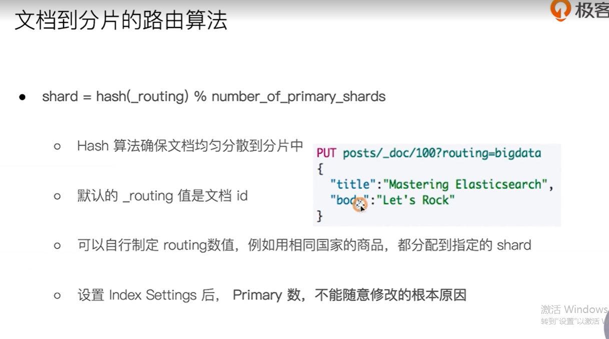
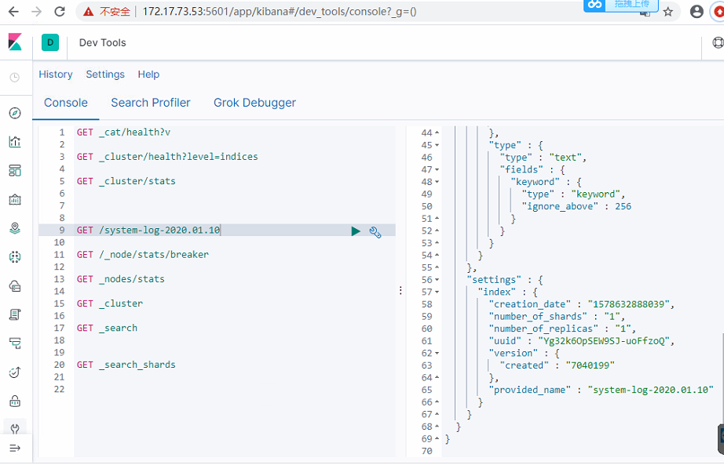

# 背景

了解 index 写入过程， 追踪  相关的存储过程





## 当前 2节点的存储结构


### index 

```
elk@node1:~/elasticsearch/elasticsearch-7.4.1/data/nodes/0/indices/mRg4u1IoQeG8b40itMz9aA/0/index$ ll
total 332
drwxrwxr-x 2 elk elk   4096 Feb  2 11:56 ./
drwxrwxr-x 5 elk elk   4096 Feb  2 11:56 ../
-rw-rw-r-- 1 elk elk    405 Jan 13 08:00 _0.cfe
-rw-rw-r-- 1 elk elk   5958 Jan 13 08:00 _0.cfs
-rw-rw-r-- 1 elk elk    404 Jan 13 08:00 _0.si
-rw-rw-r-- 1 elk elk    405 Jan 13 10:06 _1.cfe
-rw-rw-r-- 1 elk elk  31963 Jan 13 10:06 _1.cfs
-rw-rw-r-- 1 elk elk    404 Jan 13 10:06 _1.si
-rw-rw-r-- 1 elk elk    405 Jan 14 08:03 _2.cfe
-rw-rw-r-- 1 elk elk 260727 Jan 14 08:03 _2.cfs
-rw-rw-r-- 1 elk elk    404 Jan 14 08:03 _2.si
-rw-rw-r-- 1 elk elk    496 Jan 14 08:03 segments_6
-rw-rw-r-- 1 elk elk      0 Jan 13 08:00 write.lock
elk@node1:~/elasticsearch/elasticsearch-7.4.1/data/nodes/0/indices/mRg4u1IoQeG8b40itMz9aA/0/index$ pwd
/home/elk/elasticsearch/elasticsearch-7.4.1/data/nodes/0/indices/mRg4u1IoQeG8b40itMz9aA/0/index


```


#创建一个index

## 创建

```
PUT /index-wsg/_doc/first
{
  "title": "My fist blog",
  "text": "i am begin to write",
  "date": "2019/11/11"
}


返回
{
  "_index" : "index-wsg",
  "_type" : "_doc",
  "_id" : "first",
  "_version" : 1,
  "result" : "created",
  "_shards" : {
    "total" : 2,
    "successful" : 1,
    "failed" : 0
  },
  "_seq_no" : 0,
  "_primary_term" : 1
}
```

确认 该index的信息,可以看到默认index 只会创建一个 primary shard 和一个 replica shard

该index的uuid 为 8m6qsma6SFa06TJL_m_bmg

```
{
  "index-wsg" : {
    "aliases" : { },
    "mappings" : {
      "properties" : {
        "date" : {
          "type" : "date",
          "format" : "yyyy/MM/dd HH:mm:ss||yyyy/MM/dd||epoch_millis"
        },
        "text" : {
          "type" : "text",
          "fields" : {
            "keyword" : {
              "type" : "keyword",
              "ignore_above" : 256
            }
          }
        },
        "title" : {
          "type" : "text",
          "fields" : {
            "keyword" : {
              "type" : "keyword",
              "ignore_above" : 256
            }
          }
        }
      }
    },
    "settings" : {
      "index" : {
        "creation_date" : "1582086155612",
        "number_of_shards" : "1",
        "number_of_replicas" : "1",
        "uuid" : "8m6qsma6SFa06TJL_m_bmg",
        "version" : {
          "created" : "7040199"
        },
        "provided_name" : "index-wsg"
      }
    }
  }
}

```

## 数据节点文件


node1 

```
elk@node1:~/elasticsearch/elasticsearch-7.4.1/data/nodes/0/indices/8m6qsma6SFa06TJL_m_bmg$ tree 
.
├── 0
│   ├── index
│   │   ├── _0.cfe
│   │   ├── _0.cfs
│   │   ├── _0.si
│   │   ├── segments_5
│   │   └── write.lock
│   ├── _state
│   │   ├── retention-leases-2.st
│   │   └── state-0.st
│   └── translog
│       ├── translog-4.tlog
│       └── translog.ckp
└── _state
    └── state-3.st

5 directories, 10 files
elk@node1:~/elasticsearch/elasticsearch-7.4.1/data/nodes/0/indices/8m6qsma6SFa06TJL_m_bmg$ ^C

```


node2

```
elk@node2:~/elasticsearch/elasticsearch-7.4.1/data/nodes/0/indices/8m6qsma6SFa06TJL_m_bmg$ tree 
.
├── 0
│   ├── index
│   │   ├── _0.cfe
│   │   ├── _0.cfs
│   │   ├── _0.si
│   │   ├── segments_4
│   │   └── write.lock
│   ├── _state
│   │   ├── retention-leases-2.st
│   │   └── state-0.st
│   └── translog
│       ├── translog-3.tlog
│       └── translog.ckp
└── _state
    └── state-3.st

5 directories, 10 files
elk@node2:~/elasticsearch/elasticsearch-7.4.1/data/nodes/0/indices/8m6qsma6SFa06TJL_m_bmg$ 
                                                                  
```

其中的segment不能用 文本编辑器正常打开，应该有过编码处理

```
elk@node2:~/elasticsearch/elasticsearch-7.4.1/data/nodes/0/indices/8m6qsma6SFa06TJL_m_bmg$ cat 0/index/segments_4 
segments        {Ff,lXbP=4
translog_uuidnH4CydFmTmiIBPR4Zd9ZPQmin_retained_seq_no1ÿÿÿÿÿÿÿÿÿlocal_checkpoint0max_unsafe_auto_id_timestamp-1
                                                       history_uuidxeZVxQYYSUmrGaPU3BUTIAtranslog_generation3sync_idgJ3CIJVuRe2lZIMbNwQt3A
max_seq_no0ﾨ@¨ elk@node2:~/elasticsearch/elasticsearch-7.4.1/data/nodes/0/indices/8m6qsma6SFa06TJL_m_bmg$ 


```


# 跟踪一个 index 的存储过程


## index 信息




可以看到 system-log-2020.01.10 所有字段的map信息，以及 生成时间，包含的shard信息，以及生成的 uuid 

```
  "settings" : {
      "index" : {
        "creation_date" : "1578632888039",
        "number_of_shards" : "1",
        "number_of_replicas" : "1",
        "uuid" : "Yg32k6OpSEW9SJ-uoFfzoQ",
        "version" : {
          "created" : "7040199"
        },
        "provided_name" : "system-log-2020.01.10"
      }
    }
  }
  
```

## 查看节点的数据目录

 本次测试集群的信息 为 2个 节点

节点1

```
elk@node1:~/elasticsearch/elasticsearch-7.4.1/data/nodes/0/indices/Yg32k6OpSEW9SJ-uoFfzoQ$ tree 
.
├── 0
│   ├── index
│   │   ├── _2h.cfe
│   │   ├── _2h.cfs
│   │   ├── _2h.si
│   │   ├── _2i.cfe
│   │   ├── _2i.cfs
│   │   ├── _2i.si
│   │   ├── _2j.cfe
│   │   ├── _2j.cfs
│   │   ├── _2j.si
│   │   ├── _2l.dii
│   │   ├── _2l.dim
│   │   ├── _2l.fdt
│   │   ├── _2l.fdx
│   │   ├── _2l.fnm
│   │   ├── _2l_Lucene50_0.doc
│   │   ├── _2l_Lucene50_0.pos
│   │   ├── _2l_Lucene50_0.tim
│   │   ├── _2l_Lucene50_0.tip
│   │   ├── _2l_Lucene80_0.dvd
│   │   ├── _2l_Lucene80_0.dvm
│   │   ├── _2l.nvd
│   │   ├── _2l.nvm
│   │   ├── _2l.si
│   │   ├── segments_a
│   │   └── write.lock
│   ├── _state
│   │   ├── retention-leases-103.st
│   │   └── state-1.st
│   └── translog
│       ├── translog-7.ckp
│       ├── translog-7.tlog
│       ├── translog-8.tlog
│       └── translog.ckp
└── _state
    └── state-7.st

5 directories, 32 files
elk@node1:~/elasticsearch/elasticsearch-7.4.1/data/nodes/0/indices/Yg32k6OpSEW9SJ-uoFfzoQ$ 

```


节点2

```
elk@node2:~/elasticsearch/elasticsearch-7.4.1/data/nodes/0/indices/Yg32k6OpSEW9SJ-uoFfzoQ$ tree 
.
├── 0
│?? ├── index
│?? │?? ├── _1g.dii
│?? │?? ├── _1g.dim
│?? │?? ├── _1g.fdt
│?? │?? ├── _1g.fdx
│?? │?? ├── _1g.fnm
│?? │?? ├── _1g_Lucene50_0.doc
│?? │?? ├── _1g_Lucene50_0.pos
│?? │?? ├── _1g_Lucene50_0.tim
│?? │?? ├── _1g_Lucene50_0.tip
│?? │?? ├── _1g_Lucene80_0.dvd
│?? │?? ├── _1g_Lucene80_0.dvm
│?? │?? ├── _1g.nvd
│?? │?? ├── _1g.nvm
│?? │?? ├── _1g.si
│?? │?? ├── _21.dii
│?? │?? ├── _21.dim
│?? │?? ├── _21.fdt
│?? │?? ├── _21.fdx
│?? │?? ├── _21.fnm
│?? │?? ├── _21_Lucene50_0.doc
│?? │?? ├── _21_Lucene50_0.pos
│?? │?? ├── _21_Lucene50_0.tim
│?? │?? ├── _21_Lucene50_0.tip
│?? │?? ├── _21_Lucene80_0.dvd
│?? │?? ├── _21_Lucene80_0.dvm
│?? │?? ├── _21.nvd
│?? │?? ├── _21.nvm
│?? │?? ├── _21.si
│?? │?? ├── _2k.dii
│?? │?? ├── _2k.dim
│?? │?? ├── _2k.fdt
│?? │?? ├── _2k.fdx
│?? │?? ├── _2k.fnm
│?? │?? ├── _2k_Lucene50_0.doc
│?? │?? ├── _2k_Lucene50_0.pos
│?? │?? ├── _2k_Lucene50_0.tim
│?? │?? ├── _2k_Lucene50_0.tip
│?? │?? ├── _2k_Lucene80_0.dvd
│?? │?? ├── _2k_Lucene80_0.dvm
│?? │?? ├── _2k.nvd
│?? │?? ├── _2k.nvm
│?? │?? ├── _2k.si
│?? │?? ├── _2l.cfe
│?? │?? ├── _2l.cfs
│?? │?? ├── _2l.si
│?? │?? ├── _2m.cfe
│?? │?? ├── _2m.cfs
│?? │?? ├── _2m.si
│?? │?? ├── _2n.cfe
│?? │?? ├── _2n.cfs
│?? │?? ├── _2n.si
│?? │?? ├── _2o.cfe
│?? │?? ├── _2o.cfs
│?? │?? ├── _2o.si
│?? │?? ├── _2p.cfe
│?? │?? ├── _2p.cfs
│?? │?? ├── _2p.si
│?? │?? ├── _2q.cfe
│?? │?? ├── _2q.cfs
│?? │?? ├── _2q.si
│?? │?? ├── _2r.cfe
│?? │?? ├── _2r.cfs
│?? │?? ├── _2r.si
│?? │?? ├── _2s.cfe
│?? │?? ├── _2s.cfs
│?? │?? ├── _2s.si
│?? │?? ├── segments_8
│?? │?? └── write.lock
│?? ├── _state
│?? │?? ├── retention-leases-104.st
│?? │?? └── state-1.st
│?? └── translog
│??     ├── translog-6.ckp
│??     ├── translog-6.tlog
│??     ├── translog-7.ckp
│??     ├── translog-7.tlog
│??     ├── translog-8.tlog
│??     └── translog.ckp
└── _state
    └── state-7.st

5 directories, 77 files
elk@node2:~/elasticsearch/elasticsearch-7.4.1/data/nodes/0/indices/Yg32k6OpSEW9SJ-uoFfzoQ$ 

```


# 问题处理记录

## 待解决问题

如何 优化 segment的参数？


## es启动

尝试单节点集群，

```
[2020-04-28T16:59:34,756][INFO ][o.e.n.Node               ] [node2] initialized
[2020-04-28T16:59:34,756][INFO ][o.e.n.Node               ] [node2] starting ...
[2020-04-28T16:59:34,955][INFO ][o.e.t.TransportService   ] [node2] publish_address {10.0.0.62:9301}, bound_addresses {0.0.0.0:9301}
[2020-04-28T16:59:34,968][INFO ][o.e.b.BootstrapChecks    ] [node2] bound or publishing to a non-loopback address, enforcing bootstrap checks
[2020-04-28T16:59:34,998][INFO ][o.e.c.c.Coordinator      ] [node2] setting initial configuration to VotingConfiguration{xeS22bNmQgKIDSPeBryeCA}
[2020-04-28T16:59:35,280][WARN ][o.e.d.HandshakingTransportAddressConnector] [node2] handshake failed for [connectToRemoteMasterNode[172.17.73.62:9300]]
java.lang.IllegalStateException: handshake with [{172.17.73.62:9300}{W3FrqVxtS9OYm0S8MEgMmg}{172.17.73.62}{172.17.73.62:9300}] failed: remote cluster name [wsg-es] does not match local cluster name [wsg-single-es]


```


原因，单节点集群的配置文件中，discovery.seed_hosts: 配置项增加了 其他 host。
