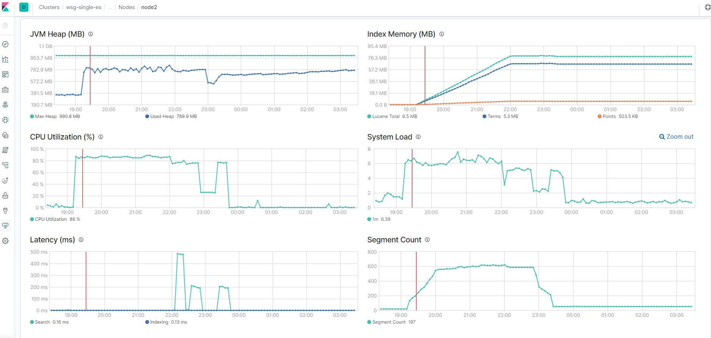
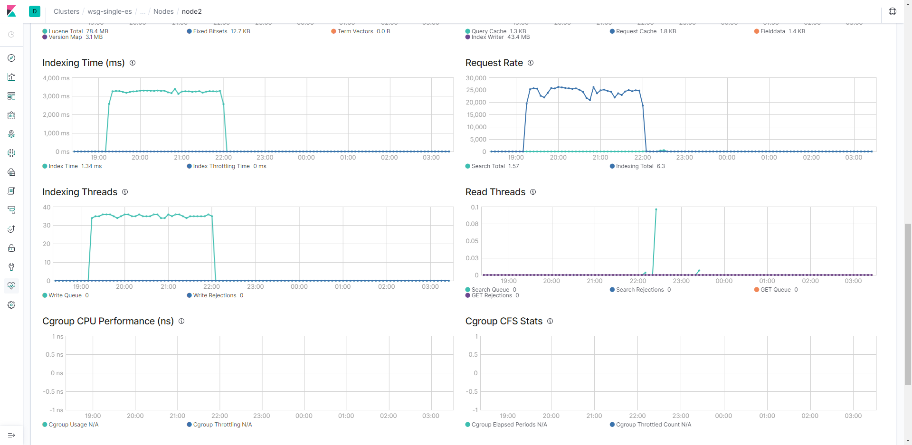
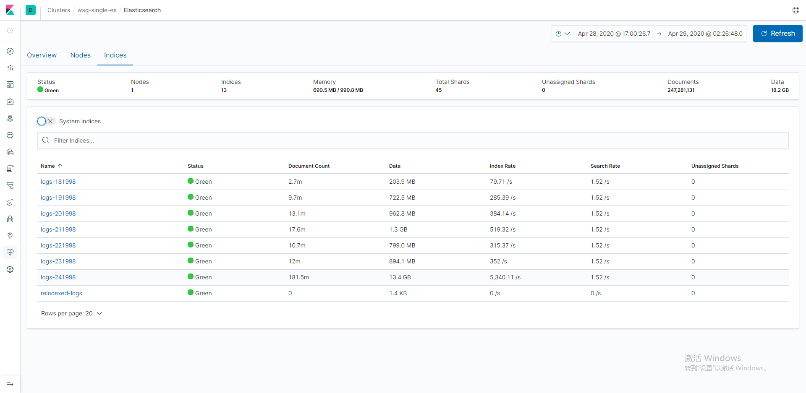
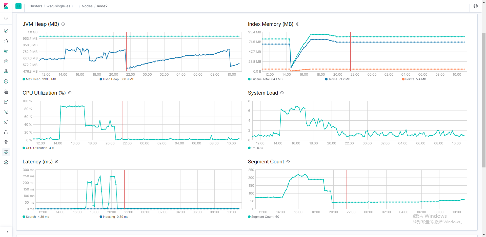
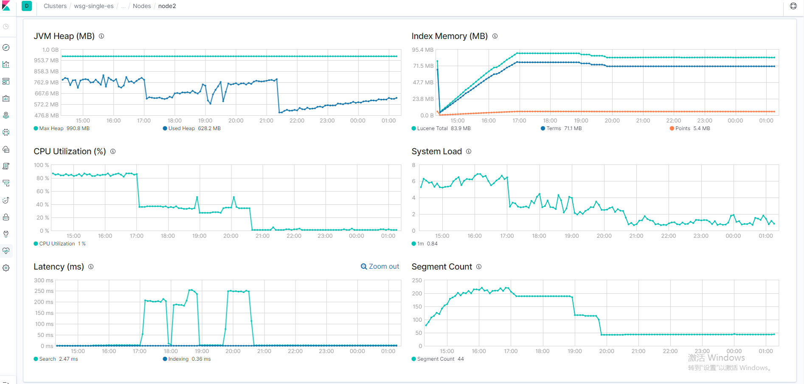

##esrally的基本概念

一次测试类比成一次汽车的拉力赛， cars 理解为被测试对象（也就是 es server），track 赛道理解为测试数据集，challenge理解为赛道上的一些特性（也就是测试数据集里面的一些特殊设置）。


track： 不同的赛道，也就是不同的类型数据，有httplog，有geodata，等。而 track.json 便是压测策略的定义文件


challenge：赛道上的挑战，也就是某类型数据下面的 一些定义好的特殊的操作（），


##esrally 部署


esrally

- install

  ```
  默认是从 官方的源中下载，可以手动添加国内的源。
  --user 将包安装到当前用户的目录，不加会默认安装到系统的路径，可能会有权限问题。
  
  pip3 install esrally --user --index-url=https://pypi.douban.com/simple
  
  
  
  安装后 因为指定了user ，要正常使用命令，需要修改path，，~/.local 目录
  
  
  ```

```
  
  下载测试数据
  
```

  track 下载

  

  ```
  


[INFO] Preparing file offset table for [/home/wsg/.rally/benchmarks/data/http_logs/documents-241998.json] ... [OK]
[INFO] Racing on track [http_logs], challenge [append-no-conflicts] and car ['external'] with version [7.4.1].


  ```


## 测试环境配置


es server配置

73.62，单节点 es 集群，vm（4核 15G），vm os位于pve CVM集群的rbd上。


esrally client

73.64，vm（4核8G），vm os位于pve CVM集群的rbd上


### 开启kibana 对es的监控

- es7.4版本 可以直接开启


- es7.6 版本基于安全的考虑 

  默认 es的配置 会报错如下：

  [exception] Security must be explicitly enabled when using a [basic] license. Enable security by setting [xpack.security.enabled] to [true] in the elasticsearch.yml file and restart the node.: Check the Elasticsearch Monitoring cluster network connection or the load level of the nodes.

  HTTP 503

  开启 xpack.security.enabled方法

  ```
  
  
  
  
  
  设置密码，设置密码也是通过 api与 es server交互，如果es 服务不在，也无法设置
  root@node1:/usr/share/elasticsearch/bin# ./elasticsearch-setup-passwords interactive
  
  Connection failure to: http://10.0.0.61:9200/_security/_authenticate?pretty failed: Connection refused
  
  ERROR: Failed to connect to elasticsearch at http://10.0.0.61:9200/_security/_authenticate?pretty. Is the URL correct and elasticsearch running?
  root@node1:/usr/share/elasticsearch/bin# 
  
  
  root@node1:/usr/share/elasticsearch/bin# ./elasticsearch-setup-passwords interactive
  Initiating the setup of passwords for reserved users elastic,apm_system,kibana,logstash_system,beats_system,remote_monitoring_user.
  You will be prompted to enter passwords as the process progresses.
  Please confirm that you would like to continue [y/N]y
  
  
  Enter password for [elastic]: 
  Reenter password for [elastic]: 
  Enter password for [apm_system]: 
  Reenter password for [apm_system]: 
  Enter password for [kibana]: 
  Reenter password for [kibana]: 
  Enter password for [logstash_system]: 
  Reenter password for [logstash_system]: 
  Enter password for [beats_system]: 
  Reenter password for [beats_system]: 
  Enter password for [remote_monitoring_user]: 
  Reenter password for [remote_monitoring_user]: 
  Changed password for user [apm_system]
  Changed password for user [kibana]
  Changed password for user [logstash_system]
  Changed password for user [beats_system]
  Changed password for user [remote_monitoring_user]
  Changed password for user [elastic]
  root@node1:/usr/share/elasticsearch/bin# 
  密码都是 elastic
  
  ```

  


## 压测httplog


### 默认track配置


```
  esrally race --pipeline=benchmark-only --target-hosts=172.17.73.62:9200  --track=http_logs

```

#### 结果


输出如下：

```
[INFO] Racing on track [http_logs], challenge [append-no-conflicts] and car ['external'] with version [7.4.1].

[WARNING] merges_total_time is 256 ms indicating that the cluster is not in a defined clean state. Recorded index time metrics may be misleading.
[WARNING] indexing_total_time is 4998 ms indicating that the cluster is not in a defined clean state. Recorded index time metrics may be misleading.
[WARNING] refresh_total_time is 1921 ms indicating that the cluster is not in a defined clean state. Recorded index time metrics may be misleading.
[WARNING] flush_total_time is 2410 ms indicating that the cluster is not in a defined clean state. Recorded index time metrics may be misleading.
Running delete-index                                                           [100% done]
Running create-index                                                           [100% done]
Running check-cluster-health                                                   [100% done]
Running index-append                                                           [100% done]
Running refresh-after-index                                                    [100% done]
Running force-merge                                                            [100% done]
Running refresh-after-force-merge                                              [100% done]
Running wait-until-merges-finish                                               [100% done]
Running default                                                                [100% done]
Running term                                                                   [100% done]
Running range                                                                  [100% done]
Running hourly_agg                                                             [100% done]
Running scroll                                                                 [100% done]
Running desc_sort_timestamp                                                    [100% done]
Running asc_sort_timestamp                                                     [100% done]
Running force-merge-1-seg                                                      [100% done]
Running refresh-after-force-merge-1-seg                                        [100% done]
Running wait-until-merges-1-seg-finish                                         [100% done]
Running desc-sort-timestamp-after-force-merge-1-seg                            [100% done]
Running asc-sort-timestamp-after-force-merge-1-seg                             [100% done]

------------------------------------------------------
    _______             __   _____
   / ____(_)___  ____ _/ /  / ___/_________  ________
  / /_  / / __ \/ __ `/ /   \__ \/ ___/ __ \/ ___/ _ \
 / __/ / / / / / /_/ / /   ___/ / /__/ /_/ / /  /  __/
/_/   /_/_/ /_/\__,_/_/   /____/\___/\____/_/   \___/
------------------------------------------------------
            
|                                                         Metric |                                        Task |      Value |    Unit |
|---------------------------------------------------------------:|--------------------------------------------:|-----------:|--------:|
|                     Cumulative indexing time of primary shards |                                             |     548.59 |     min |
|             Min cumulative indexing time across primary shards |                                             |          0 |     min |
|          Median cumulative indexing time across primary shards |                                             |    4.70987 |     min |
|             Max cumulative indexing time across primary shards |                                             |    81.6536 |     min |
|            Cumulative indexing throttle time of primary shards |                                             |          0 |     min |
|    Min cumulative indexing throttle time across primary shards |                                             |          0 |     min |
| Median cumulative indexing throttle time across primary shards |                                             |          0 |     min |
|    Max cumulative indexing throttle time across primary shards |                                             |          0 |     min |
|                        Cumulative merge time of primary shards |                                             |    151.564 |     min |
|                       Cumulative merge count of primary shards |                                             |        325 |         |
|                Min cumulative merge time across primary shards |                                             |          0 |     min |
|             Median cumulative merge time across primary shards |                                             |   0.389467 |     min |
|                Max cumulative merge time across primary shards |                                             |    29.1951 |     min |
|               Cumulative merge throttle time of primary shards |                                             |    66.4749 |     min |
|       Min cumulative merge throttle time across primary shards |                                             |          0 |     min |
|    Median cumulative merge throttle time across primary shards |                                             |     0.0327 |     min |
|       Max cumulative merge throttle time across primary shards |                                             |    14.3518 |     min |
|                      Cumulative refresh time of primary shards |                                             |    32.7783 |     min |
|                     Cumulative refresh count of primary shards |                                             |       2125 |         |
|              Min cumulative refresh time across primary shards |                                             |          0 |     min |
|           Median cumulative refresh time across primary shards |                                             |   0.291233 |     min |
|              Max cumulative refresh time across primary shards |                                             |    4.91237 |     min |
|                        Cumulative flush time of primary shards |                                             |    2.42242 |     min |
|                       Cumulative flush count of primary shards |                                             |        147 |         |
|                Min cumulative flush time across primary shards |                                             |          0 |     min |
|             Median cumulative flush time across primary shards |                                             | 0.00676667 |     min |
|                Max cumulative flush time across primary shards |                                             |     0.4333 |     min |
|                                             Total Young Gen GC |                                             |    428.463 |       s |
|                                               Total Old Gen GC |                                             |     99.733 |       s |
|                                                     Store size |                                             |    18.2351 |      GB |
|                                                  Translog size |                                             |   0.097402 |      GB |
|                                         Heap used for segments |                                             |    78.4305 |      MB |
|                                       Heap used for doc values |                                             |  0.0665474 |      MB |
|                                            Heap used for terms |                                             |    66.1865 |      MB |
|                                            Heap used for norms |                                             | 0.00268555 |      MB |
|                                           Heap used for points |                                             |    5.49635 |      MB |
|                                    Heap used for stored fields |                                             |    6.67847 |      MB |
|                                                  Segment count |                                             |         53 |         |
|                                                 Min Throughput |                                index-append |    24257.2 |  docs/s |
|                                              Median Throughput |                                index-append |      24766 |  docs/s |
|                                                 Max Throughput |                                index-append |    25495.8 |  docs/s |
|                                        50th percentile latency |                                index-append |    1526.43 |      ms |
|                                        90th percentile latency |                                index-append |    2083.09 |      ms |
|                                        99th percentile latency |                                index-append |    2941.41 |      ms |
|                                      99.9th percentile latency |                                index-append |    3921.99 |      ms |
|                                     99.99th percentile latency |                                index-append |    5018.05 |      ms |
|                                       100th percentile latency |                                index-append |    5530.09 |      ms |
|                                   50th percentile service time |                                index-append |    1526.43 |      ms |
|                                   90th percentile service time |                                index-append |    2083.09 |      ms |
|                                   99th percentile service time |                                index-append |    2941.41 |      ms |
|                                 99.9th percentile service time |                                index-append |    3921.99 |      ms |
|                                99.99th percentile service time |                                index-append |    5018.05 |      ms |
|                                  100th percentile service time |                                index-append |    5530.09 |      ms |
|                                                     error rate |                                index-append |          0 |       % |
|                                                 Min Throughput |                                     default |       8.01 |   ops/s |
|                                              Median Throughput |                                     default |       8.01 |   ops/s |
|                                                 Max Throughput |                                     default |       8.02 |   ops/s |
|                                        50th percentile latency |                                     default |    5.52226 |      ms |
|                                        90th percentile latency |                                     default |    6.65458 |      ms |
|                                        99th percentile latency |                                     default |    10.0822 |      ms |
|                                       100th percentile latency |                                     default |     15.992 |      ms |
|                                   50th percentile service time |                                     default |     5.3225 |      ms |
|                                   90th percentile service time |                                     default |    6.42305 |      ms |
|                                   99th percentile service time |                                     default |    9.88909 |      ms |
|                                  100th percentile service time |                                     default |    15.7542 |      ms |
|                                                     error rate |                                     default |          0 |       % |
|                                                 Min Throughput |                                        term |      28.05 |   ops/s |
|                                              Median Throughput |                                        term |      29.42 |   ops/s |
|                                                 Max Throughput |                                        term |      30.79 |   ops/s |
|                                        50th percentile latency |                                        term |    7499.08 |      ms |
|                                        90th percentile latency |                                        term |    7866.29 |      ms |
|                                        99th percentile latency |                                        term |    7950.27 |      ms |
|                                       100th percentile latency |                                        term |    7951.44 |      ms |
|                                   50th percentile service time |                                        term |    11.1353 |      ms |
|                                   90th percentile service time |                                        term |    18.8999 |      ms |
|                                   99th percentile service time |                                        term |    31.7685 |      ms |
|                                  100th percentile service time |                                        term |    32.7382 |      ms |
|                                                     error rate |                                        term |          0 |       % |
|                                                 Min Throughput |                                       range |          1 |   ops/s |
|                                              Median Throughput |                                       range |       1.01 |   ops/s |
|                                                 Max Throughput |                                       range |       1.01 |   ops/s |
|                                        50th percentile latency |                                       range |    39.2244 |      ms |
|                                        90th percentile latency |                                       range |    50.2072 |      ms |
|                                        99th percentile latency |                                       range |    79.2472 |      ms |
|                                       100th percentile latency |                                       range |    91.5528 |      ms |
|                                   50th percentile service time |                                       range |    38.4226 |      ms |
|                                   90th percentile service time |                                       range |    49.1931 |      ms |
|                                   99th percentile service time |                                       range |    78.2031 |      ms |
|                                  100th percentile service time |                                       range |    90.5036 |      ms |
|                                                     error rate |                                       range |          0 |       % |
|                                                 Min Throughput |                                  hourly_agg |       0.18 |   ops/s |
|                                              Median Throughput |                                  hourly_agg |       0.18 |   ops/s |
|                                                 Max Throughput |                                  hourly_agg |       0.18 |   ops/s |
|                                        50th percentile latency |                                  hourly_agg |    88633.5 |      ms |
|                                        90th percentile latency |                                  hourly_agg |     107450 |      ms |
|                                        99th percentile latency |                                  hourly_agg |     111461 |      ms |
|                                       100th percentile latency |                                  hourly_agg |     111734 |      ms |
|                                   50th percentile service time |                                  hourly_agg |    5406.86 |      ms |
|                                   90th percentile service time |                                  hourly_agg |     5917.3 |      ms |
|                                   99th percentile service time |                                  hourly_agg |    6799.31 |      ms |
|                                  100th percentile service time |                                  hourly_agg |    6856.78 |      ms |
|                                                     error rate |                                  hourly_agg |          0 |       % |
|                                                 Min Throughput |                                      scroll |      24.99 | pages/s |
|                                              Median Throughput |                                      scroll |      25.03 | pages/s |
|                                                 Max Throughput |                                      scroll |      25.08 | pages/s |
|                                        50th percentile latency |                                      scroll |     719.61 |      ms |
|                                        90th percentile latency |                                      scroll |    860.116 |      ms |
|                                        99th percentile latency |                                      scroll |    994.856 |      ms |
|                                       100th percentile latency |                                      scroll |    1095.83 |      ms |
|                                   50th percentile service time |                                      scroll |    719.245 |      ms |
|                                   90th percentile service time |                                      scroll |    859.836 |      ms |
|                                   99th percentile service time |                                      scroll |    994.491 |      ms |
|                                  100th percentile service time |                                      scroll |    1095.74 |      ms |
|                                                     error rate |                                      scroll |          0 |       % |
|                                                 Min Throughput |                         desc_sort_timestamp |       0.47 |   ops/s |
|                                              Median Throughput |                         desc_sort_timestamp |       0.47 |   ops/s |
|                                                 Max Throughput |                         desc_sort_timestamp |       0.47 |   ops/s |
|                                        50th percentile latency |                         desc_sort_timestamp |      33569 |      ms |
|                                        90th percentile latency |                         desc_sort_timestamp |    38132.5 |      ms |
|                                        99th percentile latency |                         desc_sort_timestamp |    38789.3 |      ms |
|                                       100th percentile latency |                         desc_sort_timestamp |    38807.9 |      ms |
|                                   50th percentile service time |                         desc_sort_timestamp |    2063.27 |      ms |
|                                   90th percentile service time |                         desc_sort_timestamp |       2374 |      ms |
|                                   99th percentile service time |                         desc_sort_timestamp |    2842.47 |      ms |
|                                  100th percentile service time |                         desc_sort_timestamp |    2892.76 |      ms |
|                                                     error rate |                         desc_sort_timestamp |          0 |       % |
|                                                 Min Throughput |                          asc_sort_timestamp |        0.5 |   ops/s |
|                                              Median Throughput |                          asc_sort_timestamp |        0.5 |   ops/s |
|                                                 Max Throughput |                          asc_sort_timestamp |        0.5 |   ops/s |
|                                        50th percentile latency |                          asc_sort_timestamp |    2277.35 |      ms |
|                                        90th percentile latency |                          asc_sort_timestamp |    3116.25 |      ms |
|                                        99th percentile latency |                          asc_sort_timestamp |    3400.29 |      ms |
|                                       100th percentile latency |                          asc_sort_timestamp |    3410.37 |      ms |
|                                   50th percentile service time |                          asc_sort_timestamp |    1906.67 |      ms |
|                                   90th percentile service time |                          asc_sort_timestamp |    2202.38 |      ms |
|                                   99th percentile service time |                          asc_sort_timestamp |     2493.6 |      ms |
|                                  100th percentile service time |                          asc_sort_timestamp |    2521.28 |      ms |
|                                                     error rate |                          asc_sort_timestamp |          0 |       % |
|                                                 Min Throughput | desc-sort-timestamp-after-force-merge-1-seg |       0.49 |   ops/s |
|                                              Median Throughput | desc-sort-timestamp-after-force-merge-1-seg |       0.49 |   ops/s |
|                                                 Max Throughput | desc-sort-timestamp-after-force-merge-1-seg |       0.49 |   ops/s |
|                                        50th percentile latency | desc-sort-timestamp-after-force-merge-1-seg |     387921 |      ms |
|                                        90th percentile latency | desc-sort-timestamp-after-force-merge-1-seg |     449108 |      ms |
|                                        99th percentile latency | desc-sort-timestamp-after-force-merge-1-seg |     462761 |      ms |
|                                       100th percentile latency | desc-sort-timestamp-after-force-merge-1-seg |     464206 |      ms |
|                                   50th percentile service time | desc-sort-timestamp-after-force-merge-1-seg |    1952.45 |      ms |
|                                   90th percentile service time | desc-sort-timestamp-after-force-merge-1-seg |    2320.65 |      ms |
|                                   99th percentile service time | desc-sort-timestamp-after-force-merge-1-seg |    2615.91 |      ms |
|                                  100th percentile service time | desc-sort-timestamp-after-force-merge-1-seg |    2636.02 |      ms |
|                                                     error rate | desc-sort-timestamp-after-force-merge-1-seg |          0 |       % |
|                                                 Min Throughput |  asc-sort-timestamp-after-force-merge-1-seg |       0.52 |   ops/s |
|                                              Median Throughput |  asc-sort-timestamp-after-force-merge-1-seg |       0.52 |   ops/s |
|                                                 Max Throughput |  asc-sort-timestamp-after-force-merge-1-seg |       0.52 |   ops/s |
|                                        50th percentile latency |  asc-sort-timestamp-after-force-merge-1-seg |     356571 |      ms |
|                                        90th percentile latency |  asc-sort-timestamp-after-force-merge-1-seg |     411670 |      ms |
|                                        99th percentile latency |  asc-sort-timestamp-after-force-merge-1-seg |     423927 |      ms |
|                                       100th percentile latency |  asc-sort-timestamp-after-force-merge-1-seg |     425705 |      ms |
|                                   50th percentile service time |  asc-sort-timestamp-after-force-merge-1-seg |    1848.19 |      ms |
|                                   90th percentile service time |  asc-sort-timestamp-after-force-merge-1-seg |    2219.14 |      ms |
|                                   99th percentile service time |  asc-sort-timestamp-after-force-merge-1-seg |    2588.69 |      ms |
|                                  100th percentile service time |  asc-sort-timestamp-after-force-merge-1-seg |    2614.13 |      ms |
|                                                     error rate |  asc-sort-timestamp-after-force-merge-1-seg |          0 |       % |


-----------------------------------
[INFO] SUCCESS (took 18071 seconds)
-----------------------------------
wsg@k8smaster3:/mnt/es_rally/data/rally-tracks$ 

```


#### 相关截图

测试过程es server 相关统计如下：



advance tab






### 自定义track配置

track的配置目录如下：

```
wsg@k8smaster3:~/.rally/benchmarks/tracks/default/http_logs$ ll
total 52
drwxrwxr-x  6 wsg wsg 4096 Apr 29 11:20 ./
drwxrwxr-x 16 wsg wsg 4096 Apr 26 18:32 ../
drwxrwxr-x  2 wsg wsg 4096 Apr 26 18:32 challenges/
-rw-rw-r--  1 wsg wsg  385 Apr 26 18:32 files.txt
-rw-rw-r--  1 wsg wsg 1117 Apr 26 18:32 index.json
drwxrwxr-x  2 wsg wsg 4096 Apr 26 18:32 operations/
drwxrwxr-x  2 wsg wsg 4096 Apr 28 18:39 __pycache__/
-rw-rw-r--  1 wsg wsg 5128 Apr 26 18:32 README.md
drwxrwxr-x  2 wsg wsg 4096 Apr 26 18:32 _tools/
-rw-rw-r--  1 wsg wsg 5044 Apr 26 18:32 track.json
-rw-rw-r--  1 wsg wsg  585 Apr 26 18:32 track.py
wsg@k8smaster3:~/.rally/benchmarks/tracks/default/http_logs$ 

```

默认该track生成的index 是没有 replica shard，修改其中 index.json(包括json字段的mapping 关系)

```
{
  "settings": {
    "index.number_of_shards": {{number_of_shards | default(5)}},
    "index.number_of_replicas": {{number_of_replicas | default(0)}},
    "index.requests.cache.enable": false
  },
  "mappings": {
    "dynamic": "strict",
    "_source": {
      "enabled": {{ source_enabled | default(true) | tojson }}
    },
    "properties": {
      "@timestamp": {
        "format": "strict_date_optional_time||epoch_second",
        "type": "date"
      },
      "clientip": {
        "type": "ip"
      },
      "message": {
        "type": "keyword",
        "index": false,
        "doc_values": false
      },
      "request": {
        "type": "text",
        "fields": {
          "raw": {
            "ignore_above": 256,
            "type": "keyword"
"index.json" 49L, 1117C           

```


压测过程中的并发控制 在 operation/default.json ,其中有 index的bulk 设置。

```
wsg@k8smaster3:~/.rally/benchmarks/tracks/default/http_logs/operations$ vim default.json 

    {
      "name": "index-append",
      "operation-type": "bulk",
      "bulk-size": {{bulk_size | default(5000)}},
      "ingest-percentage": {{ingest_percentage | default(100)}},
      "corpora": "http_logs"
    },
    {
      "name": "index-append-with-ingest-baseline-pipeline",
      "operation-type": "bulk",
      "bulk-size": {{bulk_size | default(5000)}},
      "ingest-percentage": {{ingest_percentage | default(100)}},
      "pipeline": "http-log-baseline-pipeline",
      "corpora": "http_logs"
    },
    {
      "name": "index-append-with-ingest-grok-pipeline",
      "operation-type": "bulk",
      "bulk-size": {{bulk_size | default(5000)}},
      "ingest-percentage": {{ingest_percentage | default(100)}},
      "pipeline": "http-log-grok-pipeline",
      "corpora": "http_logs_unparsed"
    },
    {
      "name": "index-append-with-ingest-geoip-pipeline",
      "operation-type": "bulk",
      "bulk-size": {{bulk_size | default(5000)}},
      "ingest-percentage": {{ingest_percentage | default(100)}},
      "pipeline": "http-log-geoip-pipeline",
      "corpora": "http_logs"
"default.json" 189L, 5007C                  
```


```
 esrally race --pipeline=benchmark-only --target-hosts=172.17.73.62:9200  --track=http_logs --track-params number_of_shards:1
 
 如果输入的 para参数有误会报错如下，从报错中可以看到 该track可以修改的参数。
 Some of your track parameter(s) "index.number_of_shards" are not used by this track; perhaps you intend to use "number_of_shards" instead.

All track parameters you provided are:
- index.number_of_shards

All parameters exposed by this track:
- bulk_indexing_clients
- bulk_size
- cluster_health
- conflict_probability
- conflicts
- index_settings
- ingest_percentage
- ingest_pipeline
- now
- number_of_replicas
- number_of_shards
- on_conflict
- recency
- source_enabled
- store_type
[ERROR] Cannot race. Error in race control (("Unused track parameters ['index.number_of_shards'].", None))

```


#### 结果


```
wsg@k8smaster3:/mnt/es_rally/data/rally-tracks$ esrally race --pipeline=benchmark-only --target-hosts=172.17.73.62:9200  --track=http_logs --track-params number_of_shards:1

    ____        ____
   / __ \____ _/ / /_  __
  / /_/ / __ `/ / / / / /
 / _, _/ /_/ / / / /_/ /
/_/ |_|\__,_/_/_/\__, /
                /____/


************************************************************************
************** WARNING: A dark dungeon lies ahead of you  **************
************************************************************************

Rally does not have control over the configuration of the benchmarked
Elasticsearch cluster.

Be aware that results may be misleading due to problems with the setup.
Rally is also not able to gather lots of metrics at all (like CPU usage
of the benchmarked cluster) or may even produce misleading metrics (like
the index size).

************************************************************************
****** Use this pipeline only if you are aware of the tradeoffs.  ******
*************************** Watch your step! ***************************
************************************************************************

[INFO] Racing on track [http_logs], challenge [append-no-conflicts] and car ['external'] with version [7.4.1].

[WARNING] merges_total_time is 9196019 ms indicating that the cluster is not in a defined clean state. Recorded index time metrics may be misleading.
[WARNING] merges_total_throttled_time is 3988494 ms indicating that the cluster is not in a defined clean state. Recorded index time metrics may be misleading.
[WARNING] indexing_total_time is 32993837 ms indicating that the cluster is not in a defined clean state. Recorded index time metrics may be misleading.
[WARNING] refresh_total_time is 2058014 ms indicating that the cluster is not in a defined clean state. Recorded index time metrics may be misleading.
[WARNING] flush_total_time is 145770 ms indicating that the cluster is not in a defined clean state. Recorded index time metrics may be misleading.
Running delete-index                                                           [100% done]
Running create-index                                                           [100% done]
Running check-cluster-health                                                   [100% done]
Running index-append                                                           [100% done]
Running refresh-after-index                                                    [100% done]
Running force-merge                                                            [100% done]
Running refresh-after-force-merge                                              [100% done]
Running wait-until-merges-finish                                               [100% done]
Running default                                                                [100% done]
Running term                                                                   [100% done]
Running range                                                                  [100% done]
Running hourly_agg                                                             [100% done]
Running scroll                                                                 [100% done]
Running desc_sort_timestamp                                                    [100% done]
Running asc_sort_timestamp                                                     [100% done]
Running force-merge-1-seg                                                      [100% done]
Running refresh-after-force-merge-1-seg                                        [100% done]
Running wait-until-merges-1-seg-finish                                         [100% done]
Running desc-sort-timestamp-after-force-merge-1-seg                            [100% done]
Running asc-sort-timestamp-after-force-merge-1-seg                             [100% done]

------------------------------------------------------
    _______             __   _____
   / ____(_)___  ____ _/ /  / ___/_________  ________
  / /_  / / __ \/ __ `/ /   \__ \/ ___/ __ \/ ___/ _ \
 / __/ / / / / / /_/ / /   ___/ / /__/ /_/ / /  /  __/
/_/   /_/_/ /_/\__,_/_/   /____/\___/\____/_/   \___/
------------------------------------------------------
            
|                                                         Metric |                                        Task |       Value |    Unit |
|---------------------------------------------------------------:|--------------------------------------------:|------------:|--------:|
|                     Cumulative indexing time of primary shards |                                             |     577.596 |     min |
|             Min cumulative indexing time across primary shards |                                             |           0 |     min |
|          Median cumulative indexing time across primary shards |                                             |     1.22398 |     min |
|             Max cumulative indexing time across primary shards |                                             |     427.051 |     min |
|            Cumulative indexing throttle time of primary shards |                                             |           0 |     min |
|    Min cumulative indexing throttle time across primary shards |                                             |           0 |     min |
| Median cumulative indexing throttle time across primary shards |                                             |           0 |     min |
|    Max cumulative indexing throttle time across primary shards |                                             |           0 |     min |
|                        Cumulative merge time of primary shards |                                             |      263.82 |     min |
|                       Cumulative merge count of primary shards |                                             |         847 |         |
|                Min cumulative merge time across primary shards |                                             |           0 |     min |
|             Median cumulative merge time across primary shards |                                             |     0.72705 |     min |
|                Max cumulative merge time across primary shards |                                             |     240.761 |     min |
|               Cumulative merge throttle time of primary shards |                                             |     113.533 |     min |
|       Min cumulative merge throttle time across primary shards |                                             |           0 |     min |
|    Median cumulative merge throttle time across primary shards |                                             |           0 |     min |
|       Max cumulative merge throttle time across primary shards |                                             |     110.069 |     min |
|                      Cumulative refresh time of primary shards |                                             |     14.9131 |     min |
|                     Cumulative refresh count of primary shards |                                             |        6804 |         |
|              Min cumulative refresh time across primary shards |                                             |           0 |     min |
|           Median cumulative refresh time across primary shards |                                             |    0.281417 |     min |
|              Max cumulative refresh time across primary shards |                                             |      8.3835 |     min |
|                        Cumulative flush time of primary shards |                                             |      4.8051 |     min |
|                       Cumulative flush count of primary shards |                                             |         123 |         |
|                Min cumulative flush time across primary shards |                                             |           0 |     min |
|             Median cumulative flush time across primary shards |                                             |   0.0409167 |     min |
|                Max cumulative flush time across primary shards |                                             |     3.56027 |     min |
|                                             Total Young Gen GC |                                             |     388.315 |       s |
|                                               Total Old Gen GC |                                             |      90.442 |       s |
|                                                     Store size |                                             |      20.025 |      GB |
|                                                  Translog size |                                             |    0.220531 |      GB |
|                                         Heap used for segments |                                             |     83.8082 |      MB |
|                                       Heap used for doc values |                                             |    0.221008 |      MB |
|                                            Heap used for terms |                                             |     71.0642 |      MB |
|                                            Heap used for norms |                                             | 0.000976562 |      MB |
|                                           Heap used for points |                                             |     5.37752 |      MB |
|                                    Heap used for stored fields |                                             |     7.14453 |      MB |
|                                                  Segment count |                                             |          38 |         |
|                                                 Min Throughput |                                index-append |     25636.1 |  docs/s |
|                                              Median Throughput |                                index-append |     26819.1 |  docs/s |
|                                                 Max Throughput |                                index-append |     27948.4 |  docs/s |
|                                        50th percentile latency |                                index-append |        1420 |      ms |
|                                        90th percentile latency |                                index-append |     2150.43 |      ms |
|                                        99th percentile latency |                                index-append |     3661.52 |      ms |
|                                      99.9th percentile latency |                                index-append |     4869.93 |      ms |
|                                     99.99th percentile latency |                                index-append |     6816.46 |      ms |
|                                       100th percentile latency |                                index-append |     7250.42 |      ms |
|                                   50th percentile service time |                                index-append |        1420 |      ms |
|                                   90th percentile service time |                                index-append |     2150.43 |      ms |
|                                   99th percentile service time |                                index-append |     3661.52 |      ms |
|                                 99.9th percentile service time |                                index-append |     4869.93 |      ms |
|                                99.99th percentile service time |                                index-append |     6816.46 |      ms |
|                                  100th percentile service time |                                index-append |     7250.42 |      ms |
|                                                     error rate |                                index-append |           0 |       % |
|                                                 Min Throughput |                                     default |        8.01 |   ops/s |
|                                              Median Throughput |                                     default |        8.01 |   ops/s |
|                                                 Max Throughput |                                     default |        8.02 |   ops/s |
|                                        50th percentile latency |                                     default |     3.49059 |      ms |
|                                        90th percentile latency |                                     default |     3.94188 |      ms |
|                                        99th percentile latency |                                     default |     4.47863 |      ms |
|                                       100th percentile latency |                                     default |     4.62767 |      ms |
|                                   50th percentile service time |                                     default |     3.28285 |      ms |
|                                   90th percentile service time |                                     default |     3.67368 |      ms |
|                                   99th percentile service time |                                     default |     4.19592 |      ms |
|                                  100th percentile service time |                                     default |     4.39632 |      ms |
|                                                     error rate |                                     default |           0 |       % |
|                                                 Min Throughput |                                        term |       50.06 |   ops/s |
|                                              Median Throughput |                                        term |       50.07 |   ops/s |
|                                                 Max Throughput |                                        term |       50.08 |   ops/s |
|                                        50th percentile latency |                                        term |     5.42489 |      ms |
|                                        90th percentile latency |                                        term |     6.42142 |      ms |
|                                        99th percentile latency |                                        term |     13.0333 |      ms |
|                                       100th percentile latency |                                        term |     16.0693 |      ms |
|                                   50th percentile service time |                                        term |     5.30129 |      ms |
|                                   90th percentile service time |                                        term |     6.31198 |      ms |
|                                   99th percentile service time |                                        term |     12.9083 |      ms |
|                                  100th percentile service time |                                        term |     15.9421 |      ms |
|                                                     error rate |                                        term |           0 |       % |
|                                                 Min Throughput |                                       range |           1 |   ops/s |
|                                              Median Throughput |                                       range |        1.01 |   ops/s |
|                                                 Max Throughput |                                       range |        1.01 |   ops/s |
|                                        50th percentile latency |                                       range |      119.13 |      ms |
|                                        90th percentile latency |                                       range |     124.786 |      ms |
|                                        99th percentile latency |                                       range |     137.476 |      ms |
|                                       100th percentile latency |                                       range |     140.903 |      ms |
|                                   50th percentile service time |                                       range |     118.174 |      ms |
|                                   90th percentile service time |                                       range |     123.807 |      ms |
|                                   99th percentile service time |                                       range |     136.501 |      ms |
|                                  100th percentile service time |                                       range |      139.97 |      ms |
|                                                     error rate |                                       range |           0 |       % |
|                                                 Min Throughput |                                  hourly_agg |        0.07 |   ops/s |
|                                              Median Throughput |                                  hourly_agg |        0.07 |   ops/s |
|                                                 Max Throughput |                                  hourly_agg |        0.07 |   ops/s |
|                                        50th percentile latency |                                  hourly_agg | 1.49686e+06 |      ms |
|                                        90th percentile latency |                                  hourly_agg | 1.88739e+06 |      ms |
|                                        99th percentile latency |                                  hourly_agg | 1.97464e+06 |      ms |
|                                       100th percentile latency |                                  hourly_agg |  1.9842e+06 |      ms |
|                                   50th percentile service time |                                  hourly_agg |       14805 |      ms |
|                                   90th percentile service time |                                  hourly_agg |     15412.1 |      ms |
|                                   99th percentile service time |                                  hourly_agg |       15877 |      ms |
|                                  100th percentile service time |                                  hourly_agg |     16835.2 |      ms |
|                                                     error rate |                                  hourly_agg |           0 |       % |
|                                                 Min Throughput |                                      scroll |          25 | pages/s |
|                                              Median Throughput |                                      scroll |       25.03 | pages/s |
|                                                 Max Throughput |                                      scroll |        25.1 | pages/s |
|                                        50th percentile latency |                                      scroll |     701.137 |      ms |
|                                        90th percentile latency |                                      scroll |     811.405 |      ms |
|                                        99th percentile latency |                                      scroll |     900.389 |      ms |
|                                       100th percentile latency |                                      scroll |     948.349 |      ms |
|                                   50th percentile service time |                                      scroll |     700.803 |      ms |
|                                   90th percentile service time |                                      scroll |      811.19 |      ms |
|                                   99th percentile service time |                                      scroll |     900.125 |      ms |
|                                  100th percentile service time |                                      scroll |     947.977 |      ms |
|                                                     error rate |                                      scroll |           0 |       % |
|                                                 Min Throughput |                         desc_sort_timestamp |        0.19 |   ops/s |
|                                              Median Throughput |                         desc_sort_timestamp |        0.19 |   ops/s |
|                                                 Max Throughput |                         desc_sort_timestamp |        0.19 |   ops/s |
|                                        50th percentile latency |                         desc_sort_timestamp |      795080 |      ms |
|                                        90th percentile latency |                         desc_sort_timestamp |      919678 |      ms |
|                                        99th percentile latency |                         desc_sort_timestamp |      947400 |      ms |
|                                       100th percentile latency |                         desc_sort_timestamp |      950533 |      ms |
|                                   50th percentile service time |                         desc_sort_timestamp |     5103.27 |      ms |
|                                   90th percentile service time |                         desc_sort_timestamp |     5326.69 |      ms |
|                                   99th percentile service time |                         desc_sort_timestamp |     5529.44 |      ms |
|                                  100th percentile service time |                         desc_sort_timestamp |     5652.53 |      ms |
|                                                     error rate |                         desc_sort_timestamp |           0 |       % |
|                                                 Min Throughput |                          asc_sort_timestamp |         0.2 |   ops/s |
|                                              Median Throughput |                          asc_sort_timestamp |         0.2 |   ops/s |
|                                                 Max Throughput |                          asc_sort_timestamp |         0.2 |   ops/s |
|                                        50th percentile latency |                          asc_sort_timestamp |      783964 |      ms |
|                                        90th percentile latency |                          asc_sort_timestamp |      908294 |      ms |
|                                        99th percentile latency |                          asc_sort_timestamp |      935804 |      ms |
|                                       100th percentile latency |                          asc_sort_timestamp |      938916 |      ms |
|                                   50th percentile service time |                          asc_sort_timestamp |     5101.58 |      ms |
|                                   90th percentile service time |                          asc_sort_timestamp |     5322.11 |      ms |
|                                   99th percentile service time |                          asc_sort_timestamp |     5464.76 |      ms |
|                                  100th percentile service time |                          asc_sort_timestamp |     5503.19 |      ms |
|                                                     error rate |                          asc_sort_timestamp |           0 |       % |
|                                                 Min Throughput | desc-sort-timestamp-after-force-merge-1-seg |        0.21 |   ops/s |
|                                              Median Throughput | desc-sort-timestamp-after-force-merge-1-seg |        0.21 |   ops/s |
|                                                 Max Throughput | desc-sort-timestamp-after-force-merge-1-seg |        0.21 |   ops/s |
|                                        50th percentile latency | desc-sort-timestamp-after-force-merge-1-seg |  1.0777e+06 |      ms |
|                                        90th percentile latency | desc-sort-timestamp-after-force-merge-1-seg | 1.24863e+06 |      ms |
|                                        99th percentile latency | desc-sort-timestamp-after-force-merge-1-seg | 1.28671e+06 |      ms |
|                                       100th percentile latency | desc-sort-timestamp-after-force-merge-1-seg | 1.29097e+06 |      ms |
|                                   50th percentile service time | desc-sort-timestamp-after-force-merge-1-seg |     4763.14 |      ms |
|                                   90th percentile service time | desc-sort-timestamp-after-force-merge-1-seg |     4898.19 |      ms |
|                                   99th percentile service time | desc-sort-timestamp-after-force-merge-1-seg |     5131.76 |      ms |
|                                  100th percentile service time | desc-sort-timestamp-after-force-merge-1-seg |      5363.7 |      ms |
|                                                     error rate | desc-sort-timestamp-after-force-merge-1-seg |           0 |       % |
|                                                 Min Throughput |  asc-sort-timestamp-after-force-merge-1-seg |        0.21 |   ops/s |
|                                              Median Throughput |  asc-sort-timestamp-after-force-merge-1-seg |        0.21 |   ops/s |
|                                                 Max Throughput |  asc-sort-timestamp-after-force-merge-1-seg |        0.21 |   ops/s |
|                                        50th percentile latency |  asc-sort-timestamp-after-force-merge-1-seg | 1.08208e+06 |      ms |
|                                        90th percentile latency |  asc-sort-timestamp-after-force-merge-1-seg | 1.25149e+06 |      ms |
|                                        99th percentile latency |  asc-sort-timestamp-after-force-merge-1-seg | 1.28945e+06 |      ms |
|                                       100th percentile latency |  asc-sort-timestamp-after-force-merge-1-seg | 1.29359e+06 |      ms |
|                                   50th percentile service time |  asc-sort-timestamp-after-force-merge-1-seg |     4766.29 |      ms |
|                                   90th percentile service time |  asc-sort-timestamp-after-force-merge-1-seg |     4989.62 |      ms |
|                                   99th percentile service time |  asc-sort-timestamp-after-force-merge-1-seg |     5230.58 |      ms |
|                                  100th percentile service time |  asc-sort-timestamp-after-force-merge-1-seg |     6118.46 |      ms |
|                                                     error rate |  asc-sort-timestamp-after-force-merge-1-seg |           0 |       % |


-----------------------------------
[INFO] SUCCESS (took 22524 seconds)
-----------------------------------
wsg@k8smaster3:/mnt/es_rally/data/rally-tracks$ 

```


#### 相关截图


es server 相关统计

这一轮测试的时间是从 14：10左右开始（系统负载开始上升，测试开始会 删除index，所以看到index 的mem会有个明显下降，所以第二轮测试应该也不会有上一轮 缓存的影响），



进一步 放大对应时间段：




### 结果对比

目前esrally跑了2 轮测试，并且可以看到第二轮 修改了 默认参数，如下

```
wsg@k8smaster3:/mnt/es_rally/data/rally-tracks$ esrally list races

    ____        ____
   / __ \____ _/ / /_  __
  / /_/ / __ `/ / / / / /
 / _, _/ /_/ / / / /_/ /
/_/ |_|\__,_/_/_/\__, /
                /____/


Recent races:

Race ID                               Race Timestamp    Track      Track Parameters    Challenge            Car       User Tags    Track Revision    Team Revision
------------------------------------  ----------------  ---------  ------------------  -------------------  --------  -----------  ----------------  ---------------
e2ad449a-f717-4871-831d-363f22b2e31d  20200429T062138Z  http_logs  number_of_shards=1  append-no-conflicts  external               a2aea14
1ffb38a3-2570-411b-aa17-039f9d0190a5  20200428T104349Z  http_logs                      append-no-conflicts  external               a2aea14

-------------------------------
[INFO] SUCCESS (took 0 seconds)
-------------------------------
wsg@k8smaster3:/mnt/es_rally/data/rally-tracks$ 


wsg@k8smaster3:/mnt/es_rally/data/rally-tracks$ esrally compare -h
usage: esrally compare [-h] --baseline BASELINE --contender CONTENDER [--report-format {markdown,csv}] [--report-file REPORT_FILE] [--quiet]

optional arguments:
  -h, --help            show this help message and exit
  --baseline BASELINE   Race ID of the baseline (see esrally list races).
  --contender CONTENDER
                        Race ID of the contender (see esrally list races).


```


结果如下

````
wsg@k8smaster3:/mnt/es_rally/data/rally-tracks$ esrally compare --baseline 1ffb38a3-2570-411b-aa17-039f9d0190a5 --contender e2ad449a-f717-4871-831d-363f22b2e31d 

    ____        ____
   / __ \____ _/ / /_  __
  / /_/ / __ `/ / / / / /
 / _, _/ /_/ / / / /_/ /
/_/ |_|\__,_/_/_/\__, /
                /____/


Comparing baseline
  Race ID: 1ffb38a3-2570-411b-aa17-039f9d0190a5
  Race timestamp: 2020-04-28 10:43:49
  Challenge: append-no-conflicts
  Car: external

with contender
  Race ID: e2ad449a-f717-4871-831d-363f22b2e31d
  Race timestamp: 2020-04-29 06:21:38
  Challenge: append-no-conflicts
  Car: external

------------------------------------------------------
    _______             __   _____
   / ____(_)___  ____ _/ /  / ___/_________  ________
  / /_  / / __ \/ __ `/ /   \__ \/ ___/ __ \/ ___/ _ \
 / __/ / / / / / /_/ / /   ___/ / /__/ /_/ / /  /  __/
/_/   /_/_/ /_/\__,_/_/   /____/\___/\____/_/   \___/
------------------------------------------------------
            
|                                                        Metric |                                        Task |   Baseline |   Contender |        Diff |    Unit |
|--------------------------------------------------------------:|--------------------------------------------:|-----------:|------------:|------------:|--------:|
|                    Cumulative indexing time of primary shards |                                             |     548.59 |     577.596 |     29.0057 |     min |
|             Min cumulative indexing time across primary shard |                                             |          0 |           0 |           0 |     min |
|          Median cumulative indexing time across primary shard |                                             |    4.70987 |     1.22398 |    -3.48588 |     min |
|             Max cumulative indexing time across primary shard |                                             |    81.6536 |     427.051 |     345.398 |     min |
|           Cumulative indexing throttle time of primary shards |                                             |          0 |           0 |           0 |     min |
|    Min cumulative indexing throttle time across primary shard |                                             |          0 |           0 |           0 |     min |
| Median cumulative indexing throttle time across primary shard |                                             |          0 |           0 |           0 |     min |
|    Max cumulative indexing throttle time across primary shard |                                             |          0 |           0 |           0 |     min |
|                       Cumulative merge time of primary shards |                                             |    151.564 |      263.82 |     112.256 |     min |
|                      Cumulative merge count of primary shards |                                             |        325 |         847 |         522 |         |
|                Min cumulative merge time across primary shard |                                             |          0 |           0 |           0 |     min |
|             Median cumulative merge time across primary shard |                                             |   0.389467 |     0.72705 |     0.33758 |     min |
|                Max cumulative merge time across primary shard |                                             |    29.1951 |     240.761 |     211.566 |     min |
|              Cumulative merge throttle time of primary shards |                                             |    66.4749 |     113.533 |     47.0584 |     min |
|       Min cumulative merge throttle time across primary shard |                                             |          0 |           0 |           0 |     min |
|    Median cumulative merge throttle time across primary shard |                                             |     0.0327 |           0 |     -0.0327 |     min |
|       Max cumulative merge throttle time across primary shard |                                             |    14.3518 |     110.069 |     95.7169 |     min |
|                     Cumulative refresh time of primary shards |                                             |    32.7783 |     14.9131 |    -17.8652 |     min |
|                    Cumulative refresh count of primary shards |                                             |       2125 |        6804 |        4679 |         |
|              Min cumulative refresh time across primary shard |                                             |          0 |           0 |           0 |     min |
|           Median cumulative refresh time across primary shard |                                             |   0.291233 |    0.281417 |    -0.00982 |     min |
|              Max cumulative refresh time across primary shard |                                             |    4.91237 |      8.3835 |     3.47113 |     min |
|                       Cumulative flush time of primary shards |                                             |    2.42242 |      4.8051 |     2.38268 |     min |
|                      Cumulative flush count of primary shards |                                             |        147 |         123 |         -24 |         |
|                Min cumulative flush time across primary shard |                                             |          0 |           0 |           0 |     min |
|             Median cumulative flush time across primary shard |                                             | 0.00676667 |   0.0409167 |     0.03415 |     min |
|                Max cumulative flush time across primary shard |                                             |     0.4333 |     3.56027 |     3.12697 |     min |
|                                            Total Young Gen GC |                                             |    428.463 |     388.315 |     -40.148 |       s |
|                                              Total Old Gen GC |                                             |     99.733 |      90.442 |      -9.291 |       s |
|                                                    Store size |                                             |    18.2351 |      20.025 |     1.78983 |      GB |
|                                                 Translog size |                                             |   0.097402 |    0.220531 |     0.12313 |      GB |
|                                        Heap used for segments |                                             |    78.4305 |     83.8082 |      5.3777 |      MB |
|                                      Heap used for doc values |                                             |  0.0665474 |    0.221008 |     0.15446 |      MB |
|                                           Heap used for terms |                                             |    66.1865 |     71.0642 |     4.87772 |      MB |
|                                           Heap used for norms |                                             | 0.00268555 | 0.000976562 |    -0.00171 |      MB |
|                                          Heap used for points |                                             |    5.49635 |     5.37752 |    -0.11882 |      MB |
|                                   Heap used for stored fields |                                             |    6.67847 |     7.14453 |     0.46606 |      MB |
|                                                 Segment count |                                             |         53 |          38 |         -15 |         |
|                                                Min Throughput |                                index-append |    24257.2 |     25636.1 |     1378.91 |  docs/s |
|                                             Median Throughput |                                index-append |      24766 |     26819.1 |      2053.1 |  docs/s |
|                                                Max Throughput |                                index-append |    25495.8 |     27948.4 |     2452.62 |  docs/s |
|                                       50th percentile latency |                                index-append |    1526.43 |        1420 |    -106.431 |      ms |
|                                       90th percentile latency |                                index-append |    2083.09 |     2150.43 |     67.3397 |      ms |
|                                       99th percentile latency |                                index-append |    2941.41 |     3661.52 |     720.115 |      ms |
|                                     99.9th percentile latency |                                index-append |    3921.99 |     4869.93 |     947.937 |      ms |
|                                    99.99th percentile latency |                                index-append |    5018.05 |     6816.46 |     1798.41 |      ms |
|                                      100th percentile latency |                                index-append |    5530.09 |     7250.42 |     1720.34 |      ms |
|                                  50th percentile service time |                                index-append |    1526.43 |        1420 |    -106.431 |      ms |
|                                  90th percentile service time |                                index-append |    2083.09 |     2150.43 |     67.3397 |      ms |
|                                  99th percentile service time |                                index-append |    2941.41 |     3661.52 |     720.115 |      ms |
|                                99.9th percentile service time |                                index-append |    3921.99 |     4869.93 |     947.937 |      ms |
|                               99.99th percentile service time |                                index-append |    5018.05 |     6816.46 |     1798.41 |      ms |
|                                 100th percentile service time |                                index-append |    5530.09 |     7250.42 |     1720.34 |      ms |
|                                                    error rate |                                index-append |          0 |           0 |           0 |       % |
|                                                Min Throughput |                                     default |    8.01288 |     8.01313 |     0.00025 |   ops/s |
|                                             Median Throughput |                                     default |    8.01394 |      8.0142 |     0.00026 |   ops/s |
|                                                Max Throughput |                                     default |     8.0152 |     8.01539 |     0.00019 |   ops/s |
|                                       50th percentile latency |                                     default |    5.52226 |     3.49059 |    -2.03166 |      ms |
|                                       90th percentile latency |                                     default |    6.65458 |     3.94188 |     -2.7127 |      ms |
|                                       99th percentile latency |                                     default |    10.0822 |     4.47863 |    -5.60355 |      ms |
|                                      100th percentile latency |                                     default |     15.992 |     4.62767 |    -11.3644 |      ms |
|                                  50th percentile service time |                                     default |     5.3225 |     3.28285 |    -2.03966 |      ms |
|                                  90th percentile service time |                                     default |    6.42305 |     3.67368 |    -2.74937 |      ms |
|                                  99th percentile service time |                                     default |    9.88909 |     4.19592 |    -5.69317 |      ms |
|                                 100th percentile service time |                                     default |    15.7542 |     4.39632 |    -11.3579 |      ms |
|                                                    error rate |                                     default |          0 |           0 |           0 |       % |
|                                                Min Throughput |                                        term |     28.052 |     50.0641 |     22.0121 |   ops/s |
|                                             Median Throughput |                                        term |    29.4202 |     50.0702 |       20.65 |   ops/s |
|                                                Max Throughput |                                        term |    30.7883 |     50.0763 |      19.288 |   ops/s |
|                                       50th percentile latency |                                        term |    7499.08 |     5.42489 |    -7493.65 |      ms |
|                                       90th percentile latency |                                        term |    7866.29 |     6.42142 |    -7859.87 |      ms |
|                                       99th percentile latency |                                        term |    7950.27 |     13.0333 |    -7937.23 |      ms |
|                                      100th percentile latency |                                        term |    7951.44 |     16.0693 |    -7935.37 |      ms |
|                                  50th percentile service time |                                        term |    11.1353 |     5.30129 |    -5.83397 |      ms |
|                                  90th percentile service time |                                        term |    18.8999 |     6.31198 |    -12.5879 |      ms |
|                                  99th percentile service time |                                        term |    31.7685 |     12.9083 |    -18.8603 |      ms |
|                                 100th percentile service time |                                        term |    32.7382 |     15.9421 |    -16.7962 |      ms |
|                                                    error rate |                                        term |          0 |           0 |           0 |       % |
|                                                Min Throughput |                                       range |    1.00481 |     1.00442 |    -0.00039 |   ops/s |
|                                             Median Throughput |                                       range |    1.00641 |     1.00589 |    -0.00052 |   ops/s |
|                                                Max Throughput |                                       range |     1.0096 |     1.00881 |    -0.00079 |   ops/s |
|                                       50th percentile latency |                                       range |    39.2244 |      119.13 |     79.9059 |      ms |
|                                       90th percentile latency |                                       range |    50.2072 |     124.786 |      74.579 |      ms |
|                                       99th percentile latency |                                       range |    79.2472 |     137.476 |      58.229 |      ms |
|                                      100th percentile latency |                                       range |    91.5528 |     140.903 |     49.3498 |      ms |
|                                  50th percentile service time |                                       range |    38.4226 |     118.174 |     79.7511 |      ms |
|                                  90th percentile service time |                                       range |    49.1931 |     123.807 |     74.6137 |      ms |
|                                  99th percentile service time |                                       range |    78.2031 |     136.501 |     58.2979 |      ms |
|                                 100th percentile service time |                                       range |    90.5036 |      139.97 |     49.4668 |      ms |
|                                                    error rate |                                       range |          0 |           0 |           0 |       % |
|                                                Min Throughput |                                  hourly_agg |   0.178856 |   0.0669909 |    -0.11186 |   ops/s |
|                                             Median Throughput |                                  hourly_agg |   0.180073 |   0.0670691 |      -0.113 |   ops/s |
|                                                Max Throughput |                                  hourly_agg |   0.180712 |   0.0671321 |    -0.11358 |   ops/s |
|                                       50th percentile latency |                                  hourly_agg |    88633.5 | 1.49686e+06 | 1.40823e+06 |      ms |
|                                       90th percentile latency |                                  hourly_agg |     107450 | 1.88739e+06 | 1.77994e+06 |      ms |
|                                       99th percentile latency |                                  hourly_agg |     111461 | 1.97464e+06 | 1.86318e+06 |      ms |
|                                      100th percentile latency |                                  hourly_agg |     111734 |  1.9842e+06 | 1.87247e+06 |      ms |
|                                  50th percentile service time |                                  hourly_agg |    5406.86 |       14805 |     9398.19 |      ms |
|                                  90th percentile service time |                                  hourly_agg |     5917.3 |     15412.1 |     9494.83 |      ms |
|                                  99th percentile service time |                                  hourly_agg |    6799.31 |       15877 |     9077.65 |      ms |
|                                 100th percentile service time |                                  hourly_agg |    6856.78 |     16835.2 |     9978.41 |      ms |
|                                                    error rate |                                  hourly_agg |          0 |           0 |           0 |       % |
|                                                Min Throughput |                                      scroll |    24.9865 |     25.0045 |     0.01795 | pages/s |
|                                             Median Throughput |                                      scroll |    25.0313 |     25.0349 |     0.00357 | pages/s |
|                                                Max Throughput |                                      scroll |    25.0779 |     25.0953 |     0.01749 | pages/s |
|                                       50th percentile latency |                                      scroll |     719.61 |     701.137 |    -18.4733 |      ms |
|                                       90th percentile latency |                                      scroll |    860.116 |     811.405 |    -48.7105 |      ms |
|                                       99th percentile latency |                                      scroll |    994.856 |     900.389 |    -94.4671 |      ms |
|                                      100th percentile latency |                                      scroll |    1095.83 |     948.349 |    -147.486 |      ms |
|                                  50th percentile service time |                                      scroll |    719.245 |     700.803 |    -18.4425 |      ms |
|                                  90th percentile service time |                                      scroll |    859.836 |      811.19 |    -48.6455 |      ms |
|                                  99th percentile service time |                                      scroll |    994.491 |     900.125 |    -94.3661 |      ms |
|                                 100th percentile service time |                                      scroll |    1095.74 |     947.977 |    -147.759 |      ms |
|                                                    error rate |                                      scroll |          0 |           0 |           0 |       % |
|                                                Min Throughput |                         desc_sort_timestamp |   0.469315 |    0.193287 |    -0.27603 |   ops/s |
|                                             Median Throughput |                         desc_sort_timestamp |   0.470468 |    0.193564 |     -0.2769 |   ops/s |
|                                                Max Throughput |                         desc_sort_timestamp |   0.471519 |    0.193756 |    -0.27776 |   ops/s |
|                                       50th percentile latency |                         desc_sort_timestamp |      33569 |      795080 |      761511 |      ms |
|                                       90th percentile latency |                         desc_sort_timestamp |    38132.5 |      919678 |      881545 |      ms |
|                                       99th percentile latency |                         desc_sort_timestamp |    38789.3 |      947400 |      908611 |      ms |
|                                      100th percentile latency |                         desc_sort_timestamp |    38807.9 |      950533 |      911725 |      ms |
|                                  50th percentile service time |                         desc_sort_timestamp |    2063.27 |     5103.27 |        3040 |      ms |
|                                  90th percentile service time |                         desc_sort_timestamp |       2374 |     5326.69 |     2952.69 |      ms |
|                                  99th percentile service time |                         desc_sort_timestamp |    2842.47 |     5529.44 |     2686.98 |      ms |
|                                 100th percentile service time |                         desc_sort_timestamp |    2892.76 |     5652.53 |     2759.76 |      ms |
|                                                    error rate |                         desc_sort_timestamp |          0 |           0 |           0 |       % |
|                                                Min Throughput |                          asc_sort_timestamp |   0.498261 |    0.195092 |    -0.30317 |   ops/s |
|                                             Median Throughput |                          asc_sort_timestamp |   0.499738 |    0.195214 |    -0.30452 |   ops/s |
|                                                Max Throughput |                          asc_sort_timestamp |    0.50033 |    0.195394 |    -0.30494 |   ops/s |
|                                       50th percentile latency |                          asc_sort_timestamp |    2277.35 |      783964 |      781687 |      ms |
|                                       90th percentile latency |                          asc_sort_timestamp |    3116.25 |      908294 |      905178 |      ms |
|                                       99th percentile latency |                          asc_sort_timestamp |    3400.29 |      935804 |      932403 |      ms |
|                                      100th percentile latency |                          asc_sort_timestamp |    3410.37 |      938916 |      935505 |      ms |
|                                  50th percentile service time |                          asc_sort_timestamp |    1906.67 |     5101.58 |     3194.91 |      ms |
|                                  90th percentile service time |                          asc_sort_timestamp |    2202.38 |     5322.11 |     3119.73 |      ms |
|                                  99th percentile service time |                          asc_sort_timestamp |     2493.6 |     5464.76 |     2971.16 |      ms |
|                                 100th percentile service time |                          asc_sort_timestamp |    2521.28 |     5503.19 |     2981.91 |      ms |
|                                                    error rate |                          asc_sort_timestamp |          0 |           0 |           0 |       % |
|                                                Min Throughput | desc-sort-timestamp-after-force-merge-1-seg |    0.48735 |    0.207856 |    -0.27949 |   ops/s |
|                                             Median Throughput | desc-sort-timestamp-after-force-merge-1-seg |   0.488547 |     0.20823 |    -0.28032 |   ops/s |
|                                                Max Throughput | desc-sort-timestamp-after-force-merge-1-seg |   0.489372 |    0.208367 |      -0.281 |   ops/s |
|                                       50th percentile latency | desc-sort-timestamp-after-force-merge-1-seg |     387921 |  1.0777e+06 |      689782 |      ms |
|                                       90th percentile latency | desc-sort-timestamp-after-force-merge-1-seg |     449108 | 1.24863e+06 |      799522 |      ms |
|                                       99th percentile latency | desc-sort-timestamp-after-force-merge-1-seg |     462761 | 1.28671e+06 |      823951 |      ms |
|                                      100th percentile latency | desc-sort-timestamp-after-force-merge-1-seg |     464206 | 1.29097e+06 |      826769 |      ms |
|                                  50th percentile service time | desc-sort-timestamp-after-force-merge-1-seg |    1952.45 |     4763.14 |     2810.69 |      ms |
|                                  90th percentile service time | desc-sort-timestamp-after-force-merge-1-seg |    2320.65 |     4898.19 |     2577.54 |      ms |
|                                  99th percentile service time | desc-sort-timestamp-after-force-merge-1-seg |    2615.91 |     5131.76 |     2515.85 |      ms |
|                                 100th percentile service time | desc-sort-timestamp-after-force-merge-1-seg |    2636.02 |      5363.7 |     2727.68 |      ms |
|                                                    error rate | desc-sort-timestamp-after-force-merge-1-seg |          0 |           0 |           0 |       % |
|                                                Min Throughput |  asc-sort-timestamp-after-force-merge-1-seg |   0.519384 |    0.207548 |    -0.31184 |   ops/s |
|                                             Median Throughput |  asc-sort-timestamp-after-force-merge-1-seg |   0.521122 |    0.207657 |    -0.31346 |   ops/s |
|                                                Max Throughput |  asc-sort-timestamp-after-force-merge-1-seg |   0.522695 |    0.207908 |    -0.31479 |   ops/s |
|                                       50th percentile latency |  asc-sort-timestamp-after-force-merge-1-seg |     356571 | 1.08208e+06 |      725511 |      ms |
|                                       90th percentile latency |  asc-sort-timestamp-after-force-merge-1-seg |     411670 | 1.25149e+06 |      839817 |      ms |
|                                       99th percentile latency |  asc-sort-timestamp-after-force-merge-1-seg |     423927 | 1.28945e+06 |      865521 |      ms |
|                                      100th percentile latency |  asc-sort-timestamp-after-force-merge-1-seg |     425705 | 1.29359e+06 |      867884 |      ms |
|                                  50th percentile service time |  asc-sort-timestamp-after-force-merge-1-seg |    1848.19 |     4766.29 |      2918.1 |      ms |
|                                  90th percentile service time |  asc-sort-timestamp-after-force-merge-1-seg |    2219.14 |     4989.62 |     2770.47 |      ms |
|                                  99th percentile service time |  asc-sort-timestamp-after-force-merge-1-seg |    2588.69 |     5230.58 |     2641.89 |      ms |
|                                 100th percentile service time |  asc-sort-timestamp-after-force-merge-1-seg |    2614.13 |     6118.46 |     3504.33 |      ms |
|                                                    error rate |  asc-sort-timestamp-after-force-merge-1-seg |          0 |           0 |           0 |       % |


-------------------------------
[INFO] SUCCESS (took 0 seconds)
-------------------------------
wsg@k8smaster3:/mnt/es_rally/data/rally-tracks$ 

````

也可以把结果 保存到文件中

```
wsg@k8smaster3:/mnt/es_rally/data/rally-tracks$ esrally compare --baseline 1ffb38a3-2570-411b-aa17-039f9d0190a5 --contender e2ad449a-f717-4871-831d-363f22b2e31d --report-file esrally.compare


```


# esrally常用命令


## 自定义 track 中的选项

```
  --track-params TRACK_PARAMS
                        Define a comma-separated list of key:value pairs that are injected verbatim to the track as variables.


```


## 查看track的信息

```
wsg@k8smaster3:/mnt/es_rally/data/rally-tracks$ esrally info --track http_logs

    ____        ____
   / __ \____ _/ / /_  __
  / /_/ / __ `/ / / / / /
 / _, _/ /_/ / / / /_/ /
/_/ |_|\__,_/_/_/\__, /
                /____/

Showing details for track [http_logs]:

* Description: HTTP server log data
* Documents: 247,249,096
* Compressed Size: 1.2 GB
* Uncompressed Size: 31.1 GB

================================================
Challenge [append-no-conflicts] (run by default)
================================================

Indexes the whole document corpus using Elasticsearch default settings. We only adjust the number of replicas as we benchmark a single node cluster and Rally will only start the benchmark if the cluster turns green. Document ids are unique so all index operations are append only. After that a couple of queries are run.

Schedule:
----------

1. delete-index
2. create-index
3. check-cluster-health
4. index-append (8 clients)
5. refresh-after-index
6. force-merge
7. refresh-after-force-merge
8. wait-until-merges-finish
9. default
10. term
11. range
12. hourly_agg
13. scroll
14. desc_sort_timestamp
15. asc_sort_timestamp
16. force-merge-1-seg
17. refresh-after-force-merge-1-seg
18. wait-until-merges-1-seg-finish
19. desc-sort-timestamp-after-force-merge-1-seg
20. asc-sort-timestamp-after-force-merge-1-seg

==========================================
Challenge [append-no-conflicts-index-only]
==========================================

Indexes the whole document corpus using Elasticsearch default settings. We only adjust the number of replicas as we benchmark a single node cluster and Rally will only start the benchmark if the cluster turns green. Document ids are unique so all index operations are append only.

Schedule:
----------

1. delete-index
2. create-index
3. check-cluster-health
4. index-append (8 clients)
5. refresh-after-index
6. force-merge
7. refresh-after-force-merge
8. wait-until-merges-finish

======================================
Challenge [append-sorted-no-conflicts]
======================================

Indexes the whole document corpus in an index sorted by timestamp field in descending order (most recent first) and using a setup that will lead to a larger indexing throughput than the default settings. Document ids are unique so all index operations are append only.

Schedule:
----------

1. delete-index
2. create-index
3. check-cluster-health
4. index-append (8 clients)
5. refresh-after-index
6. force-merge
7. refresh-after-force-merge
8. wait-until-merges-finish

==================================================
Challenge [append-index-only-with-ingest-pipeline]
==================================================

Indexes the whole document corpus using Elasticsearch default settings. We only adjust the number of replicas as we benchmark a single node cluster and Rally will only start the benchmark if the cluster turns green. Document ids are unique so all index operations are append only. Runs the documents through an ingest node pipeline to parse the http logs. May require --elasticsearch-plugins='ingest-geoip' 

Schedule:
----------

1. delete-index
2. create-index
3. check-cluster-health
4. create-http-log-baseline-pipeline
5. index-append-with-ingest-baseline-pipeline (8 clients)
6. refresh-after-index
7. force-merge
8. refresh-after-force-merge
9. wait-until-merges-finish

==================
Challenge [update]
==================

Schedule:
----------

1. delete-index
2. create-index
3. check-cluster-health
4. update (8 clients)
5. refresh-after-index
6. force-merge
7. refresh-after-force-merge
8. wait-until-merges-finish

==================================================
Challenge [append-no-conflicts-index-reindex-only]
==================================================

Indexes the whole document corpus using Elasticsearch default settings. We only adjust the number of replicas as we benchmark a single node cluster and Rally will only start the benchmark if the cluster turns green. Document ids are unique so all index operations are append only. After indexing, same data are reindexed.

Schedule:
----------

1. delete-index
2. create-index
3. check-cluster-health
4. index-append (8 clients)
5. refresh-after-index
6. force-merge
7. refresh-after-force-merge
8. wait-until-merges-finish
9. reindex


-------------------------------
[INFO] SUCCESS (took 8 seconds)
-------------------------------
wsg@k8smaster3:/mnt/es_rally/data/rally-tracks$ 

```


## 查看可用的测试数据集

list track


## 查看可用的 es server配置

esrally是可以自动创建 es server的，可以看到可以配置的server类型

```
wsg@k8smaster3:/mnt/es_rally/data/rally-tracks$ esrally list cars

    ____        ____
   / __ \____ _/ / /_  __
  / /_/ / __ `/ / / / / /
 / _, _/ /_/ / / / /_/ /
/_/ |_|\__,_/_/_/\__, /
                /____/

Available cars:

Name                     Type    Description
-----------------------  ------  ----------------------------------
16gheap                  car     Sets the Java heap to 16GB
1gheap                   car     Sets the Java heap to 1GB
24gheap                  car     Sets the Java heap to 24GB
2gheap                   car     Sets the Java heap to 2GB
4gheap                   car     Sets the Java heap to 4GB
8gheap                   car     Sets the Java heap to 8GB
defaults                 car     Sets the Java heap to 1GB
basic-license            mixin   Basic License
debug-non-safepoints     mixin   More accurate CPU profiles
ea                       mixin   Enables Java assertions
fp                       mixin   Preserves frame pointers
g1gc                     mixin   Enables the G1 garbage collector
trial-license            mixin   Trial License
unpooled                 mixin   Enables Netty's unpooled allocator
x-pack-ml                mixin   X-Pack Machine Learning
x-pack-monitoring-http   mixin   X-Pack Monitoring (HTTP exporter)
x-pack-monitoring-local  mixin   X-Pack Monitoring (local exporter)
x-pack-security          mixin   X-Pack Security

-------------------------------
[INFO] SUCCESS (took 5 seconds)
-------------------------------
wsg@k8smaster3:/mnt/es_rally/data/rally-tracks$ 

```


