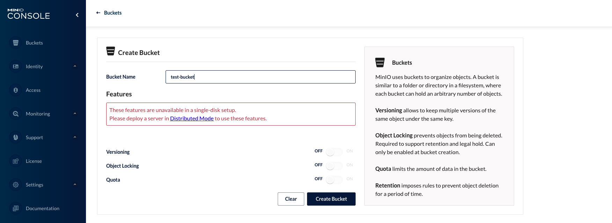
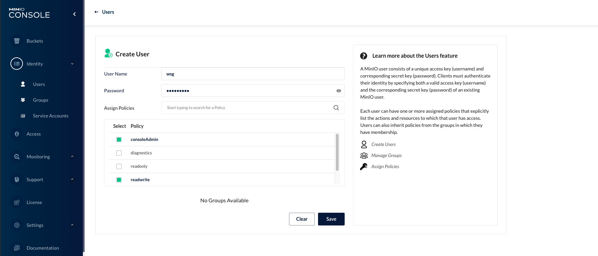
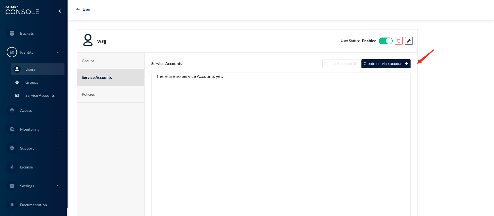
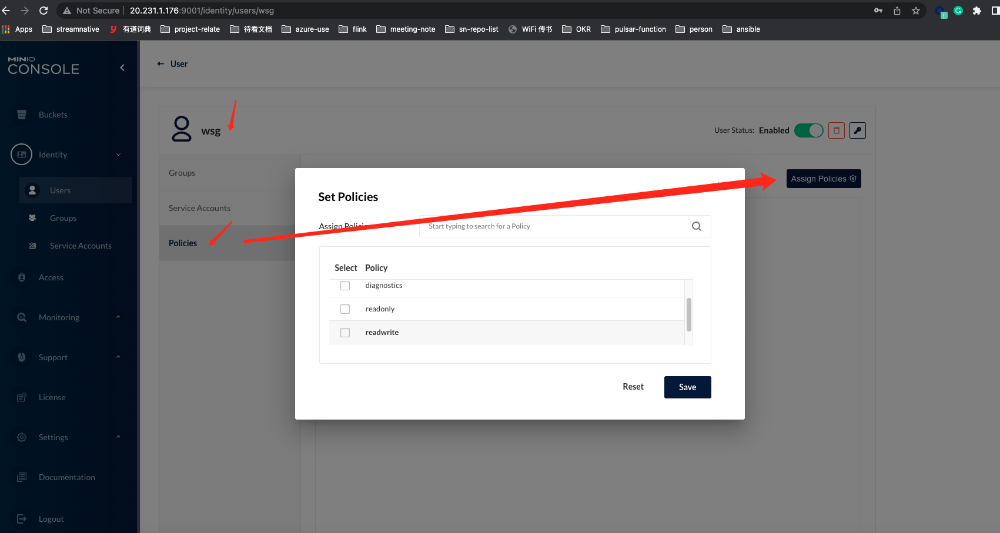

# 背景

测试功能时，需要 s3 环境来模拟测试，minio可以用来快速搭建 s3服务。 s3cmd是 linux下的 s3客户端，可以用来验证 s3服务的运行状况

# 搭建minio环境


## 部署 MinIO

### Docker 启动单机 MinIO

```
docker run -d -p 9000:9000 -p 9001:9001 quay.io/minio/minio server /data --console-address ":9001"
```

## MinIO 配置

访问 MinIO console: :9001，minioadmin/minioadmin，进行相关配置


### 创建bucket




### 创建user（选择policy）



> 可以不需要consoleAdmin policy，只要保证 readwrite 权限就可以，创建完用户后，也可以修改policy。 如果不加权限，会导致 s3cmd 命令报错如下：
>
> ```
> wsg@ansible-control:~$ s3cmd la s3://test-bucket
> ERROR: S3 error: 403 (AccessDenied): Access Denied.
> ```
>
> 


### 创建用户的 ak sk



会提示 保存 ak sk ,

```
Access Key:
J6VBQQX24587ZB6583OW

Secret Key:
HO+Q6SRfnkWzLTiwx9TQgQPRplGGSS38WiMgJDor

```


### 修改用户policy




# s3cmd 使用

验证s3服务是否正常

```

apt install s3cmd

wsg@ansible-control:~$ s3cmd --configure
一路回车 即可

填入前面步骤的 ak，sk（或者生产完 .s3cfg后，手动修改）

修改其中的2个host配置项，指向前面配置的minio s3服务
wsg@ansible-control:~$ cat .s3cfg |grep host
host_base = 127.0.0.1:9000
host_bucket = 127.0.0.1/bucket


list bucket信息
wsg@ansible-control:~$ s3cmd ls
2022-05-13 11:42  s3://offload
wsg@ansible-control:~$


创建bucket
wsg@ansible-control:~$ s3cmd mb s3://s3cmd
Bucket 's3://s3cmd/' created

上传文件
wsg@ansible-control:~$ s3cmd put ansible_test_loop.yml s3://test-bucket
upload: 'ansible_test_loop.yml' -> 's3://test-bucket/ansible_test_loop.yml'  [1 of 1]
 2143 of 2143   100% in    0s   154.30 kB/s  done
 
 查看 bucket 内容
 wsg@ansible-control:~$ s3cmd la s3://test-bucket
2022-05-29 10:59      2143   s3://test-bucket/ansible_test_loop.yml


```

> 注意：host_bucket的格式,和使用 ceph对象存储时，配置有点不一样


# 参考

https://www.cnblogs.com/sunhongleibibi/p/11661123.html

https://docs.min.io/minio/baremetal/security/minio-identity-management/user-management.html#minio-users

https://docs.min.io/minio/baremetal/console/minio-console.html?ref=con

https://docs.min.io/minio/baremetal/security/minio-identity-management/policy-based-access-control.html#minio-policy

